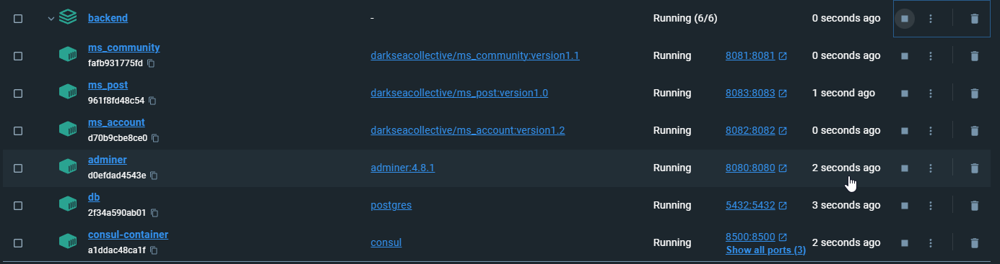
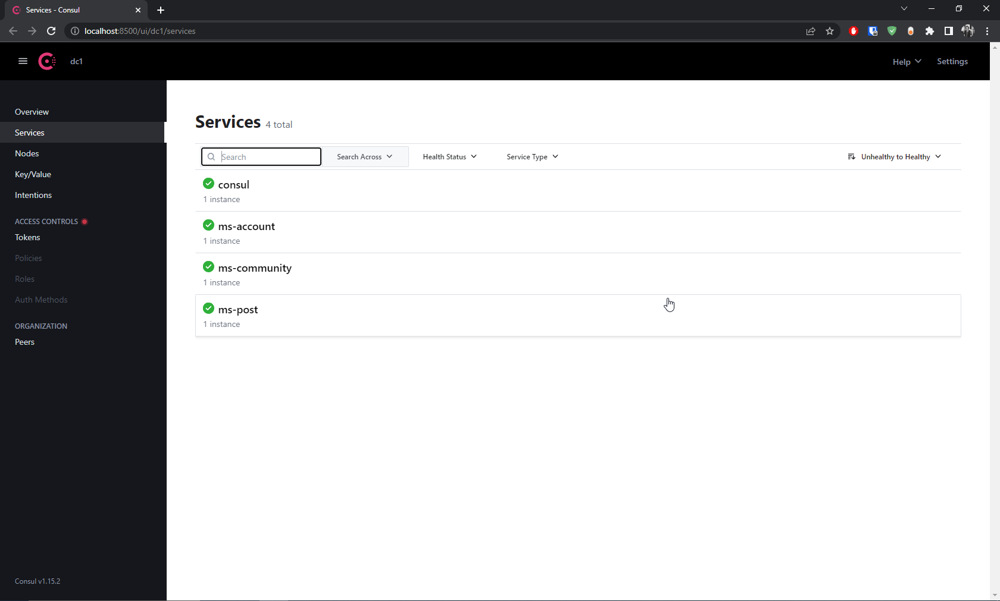

# Examen Pratique Web

## Description du livrable
Nous allons livrer une nouvelle version de notre architecture en docker qui nous permet de déployer l'entièreté de notre application avec la même commande "docker compose". Dans cette architecture, la base de donnée, l'outil de gestion de la base de donnée ainsi que le registre des services ont été configurés pour fonctionner sans problème dans le même conteneur. La partie précise livrée pour l'examen est celle du registre de services ainsi que son intégration dans les trois microservices.

## Code & output
### Ajouter les dependences nécessaires à un projet pour intégrer *consul*, notre registre de services
Pour comprendre ce qu'on doit faire pour ajouter le registre et que ça fonctionne avec nos services, il faut suivre les étapes suivantes. Le tout à déjà été intégré à notre environnement.

D'abord on ajoute les dépendences et le *dependencies manager* à chaque micro-service.

Dépendences dans le pom.xml

```xml
<dependency>
    <groupId>org.springframework.boot</groupId>
    <artifactId>spring-boot-starter-actuator</artifactId>
</dependency>
<dependency>
    <groupId>org.springframework.cloud</groupId>
    <artifactId>spring-cloud-starter-consul-discovery</artifactId>
</dependency>
```

*Dependencies manager* à mettre apres la dernière balise *dependencies* 

```xml
<dependencyManagement>
    <dependencies>
        <dependency>
            <groupId>org.springframework.cloud</groupId>
            <artifactId>spring-cloud-dependencies</artifactId>
            <version>${spring-cloud.version}</version>
            <type>pom</type>
            <scope>import</scope>
        </dependency>
    </dependencies>
</dependencyManagement>
```

Changer le code de la balise parent par celui ci

```xml
<parent>
    <groupId>org.springframework.boot</groupId>
    <artifactId>spring-boot-starter-parent</artifactId>
    <version>3.0.6</version>
    <relativePath /> <!-- lookup parent from repository -->
</parent>
```

Ajouter cette propriété dans la balise *properties* (spring cloud version)

```xml
<properties>
    <java.version>17</java.version>
    <spring-cloud.version>2022.0.1</spring-cloud.version>
</properties>
```

Dans *application.properties*, ajouter ces propriétés: changer nom_du_micro_service pour le nom de votre service et *consul-container* pour le nom du container.

```properties
spring.application.name=nom_de_micro_service
spring.cloud.consul.host=consul-container
spring.cloud.consul.port=8500
spring.cloud.consul.discovery.prefer-ip-address=true
```

Dans le compose.yaml ajouter ceci dans la propriete environnement du service

```yaml
- WAIT_FOR_HOSTS=consul-container:8500
```

Dans *depends on*, ajouter ceci

```yaml
consul-container:
  condition: service_started
```

La majorité des problèmes étaient causés par le fait que les services ont besoin que *consul* soit démarrer et de savoir où il est.

C'est intéressant de voir les différences réseaux entre Docker et le réseau d'une machine ordinaire. En effet, nous avonc appris que pour accéder aux différents services ils doivent tous être présents dans un même réseau virtuel créé par Docker. Dans notre exemple, c'est le réseau darksea, et ce réseau doit être configuré dans le mode 'bridge' pour permettre aux services d'agir comme des services qui fonctionnent sur la machine host. De plus il faut s'assurer que les services sont configurés pour exposer le port utilisé dans le conteneur à la machine host et que l'ordre de démarrage des conteneurs tiennent compte des services dont ils ont besoin. Le tout prend la forme du depends on dans le fichier compose. Nous allons mettre un exemple du fichier complet après cette section.

Voir comment nous avons configuré *consul* pour afficher son hostname et faire partie du même reseau que nos services.

Quand vous avez fait les changements, faites les commandes suivantes pour rebuild vos images et les rendre disponible pour docker.

```bash
cd ms_community/
mvn clean install
docker build -t darkseacollective/ms_community:version1.1 .
docker push darkseacollective/ms_community:version1.1
cd ..
cd backend/
docker compose down
docker compose up -d
```

Aller voir au localhost:8500 si *consul* voit vos services. Vous verrez une interface simple avec les service et leur état. Si tous fonctionne bien, il devrait y avoir des check mark vertes et le nom des services.

### Le nouveau compose.yaml pour notre nouvelle infrastructure de déploiement en docker

Remarquez le healthcheck dans la section db et les *depends on* de chaque service. Remarquez aussi l'utilisation de volumes pour rendre les données persistentes entre les exécution.

```yaml
# Use postgres/example user/password credentials
version: "3.1"

services:
  db:
    image: postgres
    container_name: db
    restart: always
    environment:
      POSTGRES_USER: darksea
      POSTGRES_PASSWORD: root
      POSTGRES_DB: hublot.hull
    healthcheck:
      test: ["CMD-SHELL", "pg_isready -U $$POSTGRES_USER -d $$POSTGRES_DB"]
      interval: 1s
    expose:
      - "5432"
    ports:
      - "5432:5432"
    networks:
      - darksea
    volumes:
      - data:/var/lib/postgresql/data

  adminer:
    image: adminer:4.8.1
    container_name: adminer
    restart: always
    ports:
      - 8080:8080
    networks:
      - darksea

  consul-container:
    container_name: consul-container
    hostname: "consul-container"
    image: consul
    command: agent -server -ui -node=server1 -bootstrap-expect=1 -client=0.0.0.0
    environment:
      - CONSUL_BIND_INTERFACE=eth0
    ports:
      - "8500:8500"
      - "8600:8600/udp"
      - "8600:8600/tcp"
    networks:
      - darksea

  ms_community:
    image: darkseacollective/ms_community:version1.1
    container_name: ms_community
    ports:
      - "8081:8081"
    networks:
      - darksea
    environment:
      - SPRING_DATASOURCE_URL=jdbc:postgresql://db:5432/hublot.hull
      - SPRING_DATASOURCE_USERNAME=darksea
      - SPRING_DATASOURCE_PASSWORD=root
      - SPRING_JPA_HIBERNATE_DDL_AUTO=update
      - WAIT_FOR_HOSTS=consul-container:8500
    depends_on:
      db:
        condition: service_healthy
      consul-container:
        condition: service_started

  ms_account:
    image: darkseacollective/ms_account:version1.2
    container_name: ms_account
    ports:
      - "8082:8082"
    networks:
      - darksea
    environment:
      - SPRING_DATASOURCE_URL=jdbc:postgresql://db:5432/hublot.hull
      - SPRING_DATASOURCE_USERNAME=darksea
      - SPRING_DATASOURCE_PASSWORD=root
      - SPRING_JPA_HIBERNATE_DDL_AUTO=update
      - WAIT_FOR_HOSTS=consul-container:8500
    depends_on:
      db:
        condition: service_healthy
      consul-container:
        condition: service_started

  ms_post:
    image: darkseacollective/ms_post:version1.0
    container_name: ms_post
    ports:
      - "8083:8083"
    networks:
      - darksea
    environment:
      - SPRING_DATASOURCE_URL=jdbc:postgresql://db:5432/hublot.hull
      - SPRING_DATASOURCE_USERNAME=darksea
      - SPRING_DATASOURCE_PASSWORD=root
      - SPRING_JPA_HIBERNATE_DDL_AUTO=update
      - WAIT_FOR_HOSTS=consul-container:8500
    depends_on:
      db:
        condition: service_healthy
      consul-container:
        condition: service_started

networks:
  darksea:
    driver: bridge

volumes:
  data:
```

### Notre livrable en image
#### Déploiement en conteneur pour tous les services backend, incluant le registre


#### Registre des services
