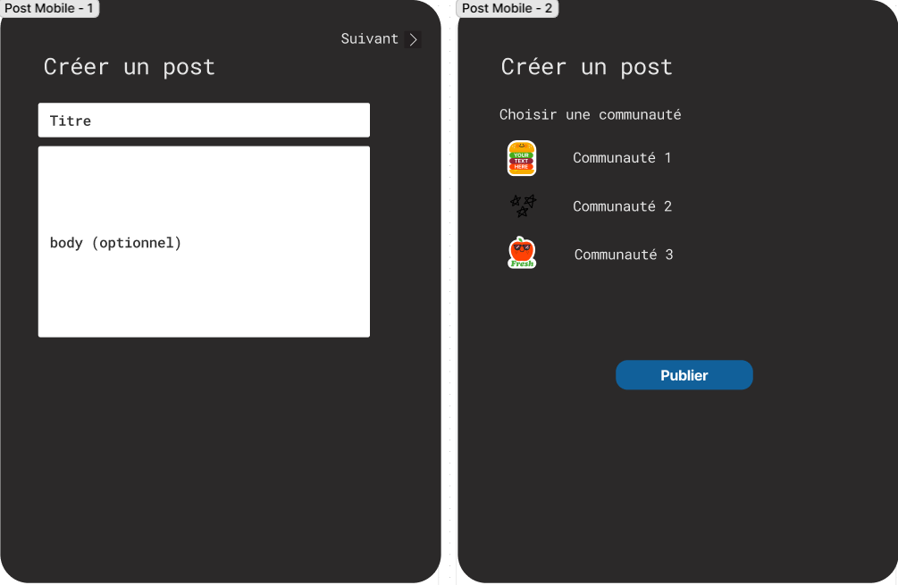

# Livrable 1
Pour le premier livrable, nous allons livrer les parties suivantes du développement du projet:

    1. Utilisation et configuration de Docker: postgres & micro-services
    2. Diagramme de classes
    3. Maquettes des différentes pages Web et mobiles
    4. API pour les micro-services suivants: compte utilisateur, publications et communautés

## Utilisation et configuration de Docker
Nous avons déployé postgres en container. Ainsi, la base de données peut facilement être utilisé sur une nouvelle machine. Cela permet aussi la conservation des données. Il suffit d'avoir Docker Desktop d'installer sur son poste de travail pour pouvoir utiliser la base de données. Responsable: Christopher

## Diagramme de classes
Le diagramme de classes décrit les relations entre les différentes entités du projet. Responsables: Christopher, Valérie et Lou


## Maquettes des pages Web et mobiles
Responsables: Valérie et Lou
### Pages Web
#### Page Connexion

#### Page Inscription

#### Page Accueil

#### Page Création de publication

#### Page Création de communauté


### Pages mobiles
#### Page Connexion

#### Page Inscription

#### Page Accueil

#### Page Création de publication

#### Page Création de communauté


## API des micro-services
### Compte utilisation
Responsable: Valérie
```java
// Entité Account
package com.example.ms_account.model;

import java.sql.Date;

import jakarta.persistence.*;
import lombok.Getter;
import lombok.Setter;

@Entity
@Getter
@Setter
@Table(name = "accounts")
public class Account {
    
    @Id
    @GeneratedValue(strategy = GenerationType.AUTO)
    private long id;

    @Column(name = "userLastName")
    private String userLastName;

    @Column(name = "userFirstName")
    private String userFirstName;

    @Column(name = "userEmail")
    private String userEmail;

    @Column(name = "userPseudo")
    private String userpseudo;

    @Column(name = "userPassword")
    private String userPassword;

    @Column(name = "userBirthday")
    private Date userBirthday;

    public Account() {

    }

    public Account(String userLastName, String userFirstName, String userEmail, String userpseudo,
            String userPassword, Date userBirthday) {
        this.userLastName = userLastName;
        this.userFirstName = userFirstName;
        this.userEmail = userEmail;
        this.userpseudo = userpseudo;
        this.userPassword = userPassword;
        this.userBirthday = userBirthday;
    }

}

```
```java
// Account Controller
package com.example.ms_account.controller;

import java.util.ArrayList;
import java.util.List;
import java.util.Optional;

import com.example.ms_account.model.Account;

import org.springframework.beans.factory.annotation.Autowired;
import org.springframework.http.HttpStatus;
import org.springframework.http.ResponseEntity;
import org.springframework.web.bind.annotation.CrossOrigin;
import org.springframework.web.bind.annotation.DeleteMapping;
import org.springframework.web.bind.annotation.GetMapping;
import org.springframework.web.bind.annotation.PathVariable;
import org.springframework.web.bind.annotation.PostMapping;
import org.springframework.web.bind.annotation.PutMapping;
import org.springframework.web.bind.annotation.RequestBody;
import org.springframework.web.bind.annotation.RequestMapping;
import org.springframework.web.bind.annotation.RestController;

import com.repository.AccountRepository;

@CrossOrigin
@RestController
@RequestMapping("/accounts")
public class AccountController {
    
    @Autowired
    AccountRepository accountRepository;

    @GetMapping("/view/all")
    public ResponseEntity<List<Account>> getAllAccounts() {
        try {
            List<Account> accountsList = new ArrayList<Account>();

            accountRepository.findAll().forEach(accountsList::add);

            if(accountsList.isEmpty()) {
                return new ResponseEntity<>(HttpStatus.NO_CONTENT);
            }

            return new ResponseEntity<>(accountsList, HttpStatus.OK);
        } catch (Exception e) {
            return new ResponseEntity<>(null, HttpStatus.INTERNAL_SERVER_ERROR);
        }
    }

    @GetMapping("/view/{id}")
    public ResponseEntity<Account> getAccountById(@PathVariable("id") long id) {
        Optional<Account> accountData = accountRepository.findById(id);

        if(accountData.isPresent()) {
            return new ResponseEntity<>(accountData.get(), HttpStatus.OK);
        }
        else {
            return new ResponseEntity<>(HttpStatus.NOT_FOUND);
        }
    }

    @PostMapping("/add")
    public ResponseEntity<Account> createAccount(@RequestBody Account account) {
        try {
            Account accountToAdd = accountRepository.save(new Account(account.getUserLastName(), account.getUserFirstName(), account.getUserEmail(), 
                                                                    account.getUserpseudo(), account.getUserPassword(), account.getUserBirthday()));
            return new ResponseEntity<>(accountToAdd, HttpStatus.CREATED);
        }
        catch (Exception e) {
            return new ResponseEntity<>(null, HttpStatus.INTERNAL_SERVER_ERROR);
        }
    }

    @PutMapping("/edit/{id}")
    public ResponseEntity<Account> updateAccount(@PathVariable("id") long id, @RequestBody Account account) {
        Optional<Account> accountData = accountRepository.findById(id);

        if(accountData.isPresent()) {
            Account modifiedAccount = accountData.get();
            modifiedAccount.setUserLastName(account.getUserLastName());
            modifiedAccount.setUserFirstName(account.getUserFirstName());
            modifiedAccount.setUserEmail(account.getUserEmail());
            modifiedAccount.setUserpseudo(account.getUserpseudo());
            modifiedAccount.setUserPassword(account.getUserPassword());
            modifiedAccount.setUserBirthday(account.getUserBirthday());

            return new ResponseEntity<>(accountRepository.save(modifiedAccount), HttpStatus.OK);
        }
        else {
            return new ResponseEntity<>(HttpStatus.NOT_FOUND);
        }
    }

    @DeleteMapping("/delete/{id}")
        public ResponseEntity<HttpStatus> deleteAccount(@PathVariable("id") long id) {
            try {
                accountRepository.deleteById(id);
                return new ResponseEntity<>(HttpStatus.NO_CONTENT);
            }
            catch (Exception e) {
                return new ResponseEntity<>(HttpStatus.INTERNAL_SERVER_ERROR);
            }
        }

}

```
```java
// Account Repository
package com.repository;

import org.springframework.data.jpa.repository.JpaRepository;
import com.example.ms_account.model.Account;

public interface AccountRepository extends JpaRepository<Account, Long> {
    
}

```

### Publication
Responsable: Lou
```java
// Entité post
package com.example.ms_post.model;

import java.sql.Date;
import jakarta.persistence.*;
import lombok.Data;
import lombok.Getter;
import lombok.Setter;

@Data
@Entity
@Getter
@Setter
@Table(name="post")
public class Post {
    
    @Id
    @GeneratedValue(strategy=GenerationType.AUTO)
    private Integer id;

    @Column(name = "postTitle")
    private String postTitle;

    @Column(name="postContent")
    private String postContent;

    @Column(name="postSource")
    private String postSource;
    
    @Column(name="postDate")
    private Date postDate;

    @Column(name="postUpvote")
    private Integer postUpvote;

    @Column(name="postDownvote")
    private Integer postDownvote;

    @Column(name="idUser")
    private Integer idUser;

    @Column(name="idCom")
    private Integer idCom;

    public Post(String postTitle, String postContent, String postSource, Date postDate, Integer postUpvote,
            Integer postDownvote, Integer idUser, Integer idCom) {
        this.postTitle = postTitle;
        this.postContent = postContent;
        this.postSource = postSource;
        this.postDate = postDate;
        this.postUpvote = postUpvote;
        this.postDownvote = postDownvote;
        this.idUser = idUser;
        this.idCom = idCom;
    }

    @Override
    public String toString() {
        return "Post [id=" + id + ", postTitle=" + postTitle + ", postContent=" + postContent + ", postSource="
                + postSource + ", postDate=" + postDate + ", postUpvote=" + postUpvote + ", postDownvote="
                + postDownvote + ", idUser=" + idUser + ", idCom=" + idCom + "]";
    }
  
    
}

```
```java
// Post Controller
package com.example.ms_post.controller;

import java.util.ArrayList;
import java.util.List;
import java.util.Optional;

import org.springframework.beans.factory.annotation.Autowired;
import org.springframework.http.HttpStatus;
import org.springframework.http.ResponseEntity;
import org.springframework.web.bind.annotation.CrossOrigin;
import org.springframework.web.bind.annotation.DeleteMapping;
import org.springframework.web.bind.annotation.GetMapping;
import org.springframework.web.bind.annotation.PathVariable;
import org.springframework.web.bind.annotation.PostMapping;
import org.springframework.web.bind.annotation.PutMapping;
import org.springframework.web.bind.annotation.RequestBody;
import org.springframework.web.bind.annotation.RequestMapping;
import org.springframework.web.bind.annotation.RestController;

import com.example.ms_post.model.Post;
import com.example.ms_post.repository.PostRepository;

@CrossOrigin(origins = "http://localost:8081")
@RestController
@RequestMapping("/posts")
public class PostController {

    @Autowired
    PostRepository postRepository;

    @GetMapping("/view/all")
    public ResponseEntity<List<Post>> getAllPosts() {
        try {
            List<Post> posts = new ArrayList<Post>();
            postRepository.findAll().forEach(posts::add);
            if(posts.isEmpty()) {
                return new ResponseEntity<>(HttpStatus.NO_CONTENT);
                     }
            return new ResponseEntity<>(posts, HttpStatus.OK);

        } catch (Exception e) {
            return new ResponseEntity<>(null, HttpStatus.INTERNAL_SERVER_ERROR);
        }
    }


    @PostMapping("/add")
    public ResponseEntity<Post> createPost(@RequestBody Post post) {
        try {
            Post _post = postRepository.save(new Post(post.getPostTitle(), post.getPostContent(), post.getPostSource(), post.getPostDate(), post.getPostUpvote(), post.getPostDownvote(), post.getPostIdUser(), post.getPostIdCom()));
            return new ResponseEntity<>(_post,HttpStatus.CREATED);
        } catch (Exception e) {
            return new ResponseEntity<>(null, HttpStatus.INTERNAL_SERVER_ERROR);
        }
    }

    @PutMapping("/edit/{id}")
    public ResponseEntity<Post> updatePost(@PathVariable("id") long id, @RequestBody Post post) {
        Optional<Post> postData = postRepository.findById(id);

        if (postData.isPresent()) {
            Post modifiedPost = postData.get();
            modifiedPost.setPostTitle(post.getPostTitle());   
            modifiedPost.setPostContent(post.getPostContent());
            modifiedPost.setPostDate(post.getPostDate());
            modifiedPost.setPostSource(post.getPostSource());
            modifiedPost.setPostUpvote(post.getPostUpvote());
            modifiedPost.setPostDownvote(post.getPostDownvote());
            modifiedPost.setPostIdUser(post.getPostIdUser());
            modifiedPost.setPostIdCom(post.getPostIdCom());
            return new ResponseEntity<>(postRepository.save(modifiedPost), HttpStatus.OK);    
        }
        else {
            return new ResponseEntity<>(HttpStatus.NOT_FOUND);
        }
    }

    @DeleteMapping("/delete/{id}")
    public ResponseEntity<HttpStatus> deletePost(@PathVariable("id") long id) {
      try {
        postRepository.deleteById(id);
        return new ResponseEntity<>(HttpStatus.NO_CONTENT);
      } catch (Exception e) {
        return new ResponseEntity<>(HttpStatus.INTERNAL_SERVER_ERROR);
      }
    }

}
```
```java
// Post Repository
package com.example.ms_post.repository;

import java.util.List;

import org.springframework.data.jpa.repository.JpaRepository;
import org.springframework.stereotype.Repository;

import com.example.ms_post.model.Post;

@Repository
public interface PostRepository extends JpaRepository<Post, Long> {
    List<Post> findByUserId(long userId);
   

}

```

### Communauté
Responsable: Christopher
```java
// Entité Community
package com.example.ms_community.model;

import java.sql.Date;

import jakarta.persistence.Column;
import jakarta.persistence.Entity;
import jakarta.persistence.GeneratedValue;
import jakarta.persistence.GenerationType;
import jakarta.persistence.Id;
import jakarta.persistence.Table;
import lombok.Getter;
import lombok.Setter;

@Table(name = "community")
@Entity
public class Community {
    @Id
    @GeneratedValue(strategy = GenerationType.AUTO)
    private Integer id;

    @Column(name = "Community name")
    @Getter 
    @Setter 
    private String communityName;

    @Column(name = "Description")
    @Getter 
    @Setter
    private String communityDescription;

    @Column(name = "Community logo")
    @Getter 
    @Setter
    private String communityLogo;

    @Column(name = "Community header image")
    @Getter 
    @Setter
    private String communityHeaderImage;

    @Column(name = "Created on")
    @Getter 
    @Setter
    private Date communityCreatedOnDate;

    @Column(name = "Ammount of members")
    @Getter 
    @Setter
    private Integer communityAmmountOfMembers;

    @Column(name = "Ammount of posts")
    @Getter 
    @Setter
    private Integer communityAmmountOfPosts;

    @Column(name = "Community creator id")
    @Getter 
    @Setter
    private Integer communityCreatorId;
}

```
```java
// Community Controller
package com.example.ms_community.controller;

import java.util.Optional;

import org.springframework.beans.factory.annotation.Autowired;
import org.springframework.web.bind.annotation.GetMapping;
import org.springframework.web.bind.annotation.PathVariable;
import org.springframework.web.bind.annotation.PostMapping;
import org.springframework.web.bind.annotation.RequestBody;
import org.springframework.web.bind.annotation.RequestMapping;
import org.springframework.web.bind.annotation.ResponseBody;
import org.springframework.web.bind.annotation.RestController;

import com.example.ms_community.model.Community;
import com.example.ms_community.repository.CommunityRepository;

@RestController
@RequestMapping("/communities")
public class CommunityController {
    @Autowired
    private CommunityRepository communityRepository;
    
    @PostMapping("/add")
    public Community addNewCommunity(@RequestBody Community newCommunity) {
        Community community = new Community();
        community.setCommunityName(newCommunity.getCommunityName());
        community.setCommunityDescription(newCommunity.getCommunityDescription());
        community.setCommunityCreatedOnDate(newCommunity.getCommunityCreatedOnDate());
        community.setCommunityCreatorId(newCommunity.getCommunityCreatorId());
        community.setCommunityLogo(newCommunity.getCommunityLogo());
        community.setCommunityHeaderImage(newCommunity.getCommunityHeaderImage());

        communityRepository.save(community);
        return community;
    }

    @GetMapping("/view/all")
    public @ResponseBody Iterable<Community> getAllCommunities() {
        return communityRepository.findAll();
    }

    @GetMapping("/view/{id}")
    public Optional<Community> getCommunityById(@PathVariable Integer id) {
        return communityRepository.findById(id);
    }

    @GetMapping("/edit/{id}")
    public String updateCommunity(@RequestBody Community updateCommunity, @PathVariable Integer id) {
        return communityRepository.findById(id)
            .map(community -> {
                community.setCommunityName(updateCommunity.getCommunityName());
                community.setCommunityDescription(updateCommunity.getCommunityDescription());
                community.setCommunityCreatedOnDate(updateCommunity.getCommunityCreatedOnDate());
                community.setCommunityCreatorId(updateCommunity.getCommunityCreatorId());
                community.setCommunityLogo(updateCommunity.getCommunityLogo());
                community.setCommunityHeaderImage(updateCommunity.getCommunityHeaderImage());
                return "Community details have been changed.";
            }).orElseGet(() -> {
                return "This community was not found in the database";
            });
    }

    @GetMapping("/delete/{id}")
    public String deleteCommunity(@PathVariable("id") Integer id) {
        communityRepository.deleteById(id);
        return "The community id: " + id + " has been deleted.";
    }
}

```
```java
// Community Repository
package com.example.ms_community.repository;

import org.springframework.data.repository.CrudRepository;
import com.example.ms_community.model.Community;;

public interface CommunityRepository extends CrudRepository<Community, Integer>{}
```