- [Livrable 2](#livrable-2)
  - [Rafinement des APIs et documentation swagger](#rafinement-des-apis-et-documentation-swagger)
    - [Micro-service: communauté](#micro-service-communauté)
    - [Micro-service: account](#micro-service-account)
    - [Micro-service: post](#micro-service-post)
    - [Screenshot: documentation Swagger](#screenshot-documentation-swagger)
    - [Community](#community)
    - [Account](#account)
    - [Post](#post)
  - [Page connexion et création de compte pour l'application mobile avec Flutter](#page-connexion-et-création-de-compte-pour-lapplication-mobile-avec-flutter)
    - [Account](#account-1)
    - [Fichier configuration](#fichier-configuration)
    - [Fichier utilities](#fichier-utilities)
    - [Page connexion](#page-connexion)
    - [Page création de compte](#page-création-de-compte)
    - [Sceenshots: résultats](#sceenshots-résultats)
      - [Connexion](#connexion)
      - [Création de compte](#création-de-compte)
  - [Début du client web en Svelte](#début-du-client-web-en-svelte)
    - [Structure du projet](#structure-du-projet)
      - [Structure](#structure)
      - [Layout](#layout)
      - [Page](#page)
      - [Header](#header)
      - [Footer](#footer)
    - [L'utilisation du dossier lib](#lutilisation-du-dossier-lib)
      - [Login](#login)
      - [Search bar](#search-bar)
      - [Side bar](#side-bar)
    - [Utilisation de d'autres fonctionnalités de *Svelte*](#utilisation-de-dautres-fonctionnalités-de-svelte)
  - [Tous les micro-services sur *Docker*](#tous-les-micro-services-sur-docker)
    - [Compose](#compose)
    - [Registre Docker hub](#registre-docker-hub)
    - [Environnement Docker Desktop](#environnement-docker-desktop)
  - [Utilisation de consul et adminer](#utilisation-de-consul-et-adminer)
    - [Consul](#consul)
    - [Adminer](#adminer)
      - [Adminer page d'accueil](#adminer-page-daccueil)
      - [Adminer database selector](#adminer-database-selector)
      - [Adminer database dashboard](#adminer-database-dashboard)
      - [Adminer data viewer](#adminer-data-viewer)

# Livrable 2
Pour le deuxième livrable, nous allons livrer les parties suivantes de notre application:

    1. Rafinement des APIs et documentation swagger
    2. Page connexion et création de compte pour l'application mobile avec Flutter
    3. Début du client web en Svelte
    4. Tous les micro-services sur *Docker*
    5. Utilisation de consul et adminer

## Rafinement des APIs et documentation swagger
Nous avons améliorer les APIS développés au livrable 1. Par exemple, le micro-service *account* contient une nouvelle entité *Moderator*. Un utilisateur peut donc maintenant être un modérateur d'une certaine communauté. Nous avons aussi ajouté la documentation *Swagger* à tous nos APIs.

### Micro-service: communauté
```java
// Entity: community
package com.example.ms_community.model;

import java.sql.Date;

import jakarta.persistence.Column;
import jakarta.persistence.Entity;
import jakarta.persistence.GeneratedValue;
import jakarta.persistence.GenerationType;
import jakarta.persistence.Id;
import jakarta.persistence.Table;
import lombok.Getter;
import lombok.Setter;

@Table(name = "community")
@Entity
@Getter 
@Setter 
public class Community {
    @Id
    @GeneratedValue(strategy = GenerationType.AUTO)
    private Integer id;

    @Column(name = "Community name")
    private String communityName;

    @Column(name = "Description")
    private String communityDescription;

    @Column(name = "Community logo")
    private String communityLogo;

    @Column(name = "Community header image")
    private String communityHeaderImage;

    @Column(name = "Created on")
    private Date communityCreatedOnDate;

    @Column(name = "Ammount of members")
    private Integer communityAmmountOfMembers;

    @Column(name = "Ammount of posts")
    private Integer communityAmmountOfPosts;

    @Column(name = "Community creator id")
    private Integer communityCreatorId;

    public Community() {

    }

    public Community(Community newCommunity) {
        this.communityName = newCommunity.getCommunityName();
        this.communityDescription = newCommunity.getCommunityDescription();
        this.communityCreatedOnDate = newCommunity.getCommunityCreatedOnDate();
        this.communityCreatorId = newCommunity.getCommunityCreatorId();
    }
}
```

```java
// Community Controller
package com.example.ms_community.controller;

import java.util.ArrayList;
import java.util.List;
import java.util.Optional;

import io.swagger.v3.oas.annotations.Operation;
import io.swagger.v3.oas.annotations.media.Content;
import io.swagger.v3.oas.annotations.media.Schema;
import io.swagger.v3.oas.annotations.responses.ApiResponse;
import io.swagger.v3.oas.annotations.responses.ApiResponses;

import org.springframework.beans.factory.annotation.Autowired;
import org.springframework.http.HttpStatus;
import org.springframework.http.ResponseEntity;
import org.springframework.web.bind.annotation.CrossOrigin;
import org.springframework.web.bind.annotation.DeleteMapping;
import org.springframework.web.bind.annotation.GetMapping;
import org.springframework.web.bind.annotation.PathVariable;
import org.springframework.web.bind.annotation.PostMapping;
import org.springframework.web.bind.annotation.PutMapping;
import org.springframework.web.bind.annotation.RequestBody;
import org.springframework.web.bind.annotation.RequestMapping;
import org.springframework.web.bind.annotation.RestController;

import com.example.ms_community.repository.CommunityRepository;
import com.example.ms_community.model.Community;;

@CrossOrigin
@RestController
@RequestMapping("/communities")
public class CommunityController {
    @Autowired
    private CommunityRepository communityRepository;

    @Operation(summary = "Adds a community do the database")
    @ApiResponses(value = {
            @ApiResponse(responseCode = "201", description = "Community created", content = {
                    @Content(mediaType = "application/json", schema = @Schema(implementation = Community.class)) }),
            @ApiResponse(responseCode = "400", description = "Invalid data", content = @Content),
            @ApiResponse(responseCode = "500", description = "Internal server error", content = @Content)
    })
    @PostMapping("/add")
    public ResponseEntity<Community> addNewCommunity(@RequestBody Community newCommunity) {
        try {
            Community communityToAdd = communityRepository.save(new Community(newCommunity));
            return new ResponseEntity<>(communityToAdd, HttpStatus.CREATED);
        } catch (Exception e) {
            return new ResponseEntity<>(null, HttpStatus.INTERNAL_SERVER_ERROR);
        }
    }

    @Operation(summary = "Gets all communities")
    @ApiResponses(value = {
            @ApiResponse(responseCode = "200", description = "Found communities", content = {
                    @Content(mediaType = "application/json", schema = @Schema(implementation = Community.class)) }),
            @ApiResponse(responseCode = "404", description = "The communities were not found", content = @Content),
            @ApiResponse(responseCode = "500", description = "Internal server error", content = @Content)
    })
    @GetMapping("/view/all")
    public ResponseEntity<List<Community>> getAllCommunities() {
        try {
            List<Community> CommunityList = new ArrayList<Community>();

            communityRepository.findAll().forEach(CommunityList::add);

            if (CommunityList.isEmpty()) {
                return new ResponseEntity<>(HttpStatus.NO_CONTENT);
            }

            return new ResponseEntity<>(CommunityList, HttpStatus.OK);
        } catch (Exception e) {
            return new ResponseEntity<>(null, HttpStatus.INTERNAL_SERVER_ERROR);
        }
    }

    @Operation(summary = "Get a community by its id")
    @ApiResponses(value = {
            @ApiResponse(responseCode = "200", description = "Found the community", content = {
                    @Content(mediaType = "application/json", schema = @Schema(implementation = Community.class)) }),
            @ApiResponse(responseCode = "400", description = "Invalid id supplied", content = @Content),
            @ApiResponse(responseCode = "404", description = "The community was not found", content = @Content),
            @ApiResponse(responseCode = "500", description = "Internal server error", content = @Content)
    })
    @GetMapping("/view/{id}")
    public ResponseEntity<Community> getCommunityById(@PathVariable("id") long id) {
        Optional<Community> CommunityData = communityRepository.findById(id);

        if (CommunityData.isPresent()) {
            return new ResponseEntity<>(CommunityData.get(), HttpStatus.OK);
        } else {
            return new ResponseEntity<>(HttpStatus.NOT_FOUND);
        }
    }

    @Operation(summary = "Edits a community by its id")
    @ApiResponses(value = {
            @ApiResponse(responseCode = "200", description = "Community updated", content = {
                    @Content(mediaType = "application/json", schema = @Schema(implementation = Community.class)) }),
            @ApiResponse(responseCode = "400", description = "Invalid id supplied", content = @Content),
            @ApiResponse(responseCode = "404", description = "The community was not found", content = @Content),
            @ApiResponse(responseCode = "500", description = "Internal server error", content = @Content)
    })
    @PutMapping("/edit/{id}")
    public ResponseEntity<Community> updateCommunity(@PathVariable("id") long id,
            @RequestBody Community updateCommunity) {
        Optional<Community> communityData = communityRepository.findById(id);

        if (communityData.isPresent()) {
            Community modifiedCommunity = communityData.get();
            modifiedCommunity = new Community(updateCommunity);
            return new ResponseEntity<>(communityRepository.save(modifiedCommunity), HttpStatus.OK);
        } else {
            return new ResponseEntity<>(HttpStatus.NOT_FOUND);
        }
    }

    @Operation(summary = "Deletes a community by its id")
    @ApiResponses(value = {
            @ApiResponse(responseCode = "200", description = "Community deleted", content = {
                    @Content(mediaType = "application/json", schema = @Schema(implementation = Community.class)) }),
            @ApiResponse(responseCode = "400", description = "Invalid id supplied", content = @Content),
            @ApiResponse(responseCode = "404", description = "The community was not found", content = @Content),
            @ApiResponse(responseCode = "500", description = "Internal server error", content = @Content)
    })
    @DeleteMapping("/delete/{id}")
    public ResponseEntity<Community> deleteCommunity(@PathVariable("id") long id) {
        Optional<Community> communityData = communityRepository.findById(id);
        if (communityData.isPresent()) {
            try {
                Community deletedCommunity = communityData.get();
                communityRepository.deleteById(id);
                return new ResponseEntity<>(deletedCommunity, HttpStatus.OK);
            } catch (Exception e) {
                return new ResponseEntity<>(HttpStatus.INTERNAL_SERVER_ERROR);
            }
        } else {
            return new ResponseEntity<>(HttpStatus.NOT_FOUND);
        }
    }
}
```

```java
// Community Repository
package com.example.ms_community.repository;

import org.springframework.data.repository.CrudRepository;
import com.example.ms_community.model.Community;;

public interface CommunityRepository extends CrudRepository<Community, Long>{}
```
### Micro-service: account
```java
// Entity: account
package com.example.ms_account.model;

import java.time.LocalDate;

import jakarta.persistence.*;
import lombok.Getter;
import lombok.Setter;

@Entity
@Getter
@Setter
@Table(name = "accounts")
public class Account {
    
    @Id
    @GeneratedValue(strategy = GenerationType.AUTO)
    private long id;

    @Column(name = "userLastName")
    private String userLastName;

    @Column(name = "userFirstName")
    private String userFirstName;

    @Column(name = "userEmail")
    private String userEmail;

    @Column(name = "userPseudo")
    private String userPseudo;

    @Column(name = "userPassword")
    private String userPassword;

    @Column(name = "userBirthday")
    private LocalDate userBirthday;

    public Account() {

    }

    public Account(String userLastName, String userFirstName, String userEmail, String userPseudo,
            String userPassword, LocalDate userBirthday) {
        this.userLastName = userLastName;
        this.userFirstName = userFirstName;
        this.userEmail = userEmail;
        this.userPseudo = userPseudo;
        this.userPassword = userPassword;
        this.userBirthday = userBirthday;
    }


}
```

```java
// Entity: moderator
package com.example.ms_account.model;

import jakarta.persistence.*;
import lombok.Getter;
import lombok.Setter;

@Entity
@Getter
@Setter
@Table(name = "moderators")
public class Moderator {

    @Id
    @GeneratedValue(strategy = GenerationType.AUTO)
    private long id;

    @Column(name = "moderatorUserId")
    private long moderatorUserId;

    @Column(name = "moderatorComId")
    private long moderatorComId;

    public Moderator() {
    }

    public Moderator(long moderatorUserId, long moderatorComId) {
        this.moderatorUserId = moderatorUserId;
        this.moderatorComId = moderatorComId;
    }

}
```

```java
//Account Controller
package com.example.ms_account.controller;

import java.util.ArrayList;
import java.util.List;
import java.util.Optional;

import com.example.ms_account.model.Account;
import com.example.ms_account.repository.AccountRepository;

import io.swagger.v3.oas.annotations.Operation;
import io.swagger.v3.oas.annotations.media.Content;
import io.swagger.v3.oas.annotations.media.Schema;
import io.swagger.v3.oas.annotations.responses.ApiResponse;
import io.swagger.v3.oas.annotations.responses.ApiResponses;

import org.springframework.beans.factory.annotation.Autowired;
import org.springframework.http.HttpStatus;
import org.springframework.http.ResponseEntity;
import org.springframework.web.bind.annotation.CrossOrigin;
import org.springframework.web.bind.annotation.DeleteMapping;
import org.springframework.web.bind.annotation.GetMapping;
import org.springframework.web.bind.annotation.PathVariable;
import org.springframework.web.bind.annotation.PostMapping;
import org.springframework.web.bind.annotation.PutMapping;
import org.springframework.web.bind.annotation.RequestBody;
import org.springframework.web.bind.annotation.RequestMapping;
import org.springframework.web.bind.annotation.RestController;

@CrossOrigin
@RestController
@RequestMapping("/accounts")
public class AccountController {
    
    @Autowired
    AccountRepository accountRepository;

    @Operation(summary = "Get all accounts")
    @ApiResponses(value = { 
        @ApiResponse (responseCode = "200", description = "Found the accounts", 
        content = {@Content (mediaType = "application/json",
        schema = @Schema (implementation = Account.class))}),
        @ApiResponse(responseCode = "404", description = "Could not find the accounts", 
            content = @Content),
        @ApiResponse(responseCode = "500", description = "Internal Server Error", 
        content = @Content) })

    @GetMapping("/view/all")
    public ResponseEntity<List<Account>> getAllAccounts() {
        try {
            List<Account> accountsList = new ArrayList<Account>();

            accountRepository.findAll().forEach(accountsList::add);

            if(accountsList.isEmpty()) {
                return new ResponseEntity<>(HttpStatus.NO_CONTENT);
            }

            return new ResponseEntity<>(accountsList, HttpStatus.OK);
        } catch (Exception e) {
            return new ResponseEntity<>(null, HttpStatus.INTERNAL_SERVER_ERROR);
        }
    }

    @Operation(summary = "Get an account by Id")
    @ApiResponses(value = { 
        @ApiResponse (responseCode = "200", description = "Account found", 
        content = {@Content (mediaType = "application/json",
        schema = @Schema (implementation = Account.class))}),
        @ApiResponse(responseCode = "404", description = "Account not found", 
            content = @Content),
        @ApiResponse(responseCode = "400", description = "Invalid id", 
        content = @Content),
        @ApiResponse(responseCode = "500", description = "Internal Server Error", 
        content = @Content) })

    @GetMapping("/view/{id}")
    public ResponseEntity<Account> getAccountById(@PathVariable("id") long id) {
        Optional<Account> accountData = accountRepository.findById(id);

        if(accountData.isPresent()) {
            return new ResponseEntity<>(accountData.get(), HttpStatus.OK);
        }
        else {
            return new ResponseEntity<>(HttpStatus.NOT_FOUND);
        }
    }

    @Operation(summary = "Get an account by pseudo and password")
    @ApiResponses(value = { 
        @ApiResponse (responseCode = "200", description = "Account found", 
        content = {@Content (mediaType = "application/json",
        schema = @Schema (implementation = Account.class))}),
        @ApiResponse(responseCode = "404", description = "Account not found", 
            content = @Content),
        @ApiResponse(responseCode = "400", description = "Invalid data", 
        content = @Content),
        @ApiResponse(responseCode = "500", description = "Internal Server Error", 
        content = @Content) })

    @GetMapping("/view/by_pseudo/{pseudo}/{password}")
    public ResponseEntity<Account> getAccountByPseudoAndPassword(@PathVariable("pseudo") String pseudo, @PathVariable("password") String password) {
        Optional<Account> accountData = accountRepository.findByUserPseudoAndUserPassword(pseudo, password);

        if(accountData.isPresent()) {
            return new ResponseEntity<>(accountData.get(), HttpStatus.OK);
        }
        else {
            return new ResponseEntity<>(HttpStatus.NOT_FOUND);
        }
    }

    @Operation(summary = "Add an account")
    @ApiResponses(value = { 
        @ApiResponse (responseCode = "201", description = "Account added", 
        content = {@Content (mediaType = "application/json",
        schema = @Schema (implementation = Account.class))}),
        @ApiResponse(responseCode = "400", description = "Invalid data", 
            content = @Content),
        @ApiResponse(responseCode = "500", description = "Internal Server Error", 
        content = @Content) })

    @PostMapping("/add")
    public ResponseEntity<Account> createAccount(@RequestBody Account account) {
        try {
            Account accountToAdd = accountRepository.save(new Account(account.getUserLastName(), account.getUserFirstName(), account.getUserEmail(), 
                                                                    account.getUserPseudo(), account.getUserPassword(), account.getUserBirthday()));
            return new ResponseEntity<>(accountToAdd, HttpStatus.CREATED);
        }
        catch (Exception e) {
            return new ResponseEntity<>(null, HttpStatus.INTERNAL_SERVER_ERROR);
        }
    }

    @Operation(summary = "Edit an account")
    @ApiResponses(value = { 
        @ApiResponse (responseCode = "200", description = "Account edited", 
        content = {@Content (mediaType = "application/json",
        schema = @Schema (implementation = Account.class))}),
        @ApiResponse(responseCode = "400", description = "Invalid data", 
            content = @Content),
        @ApiResponse(responseCode = "404", description = "Account not found", 
        content = @Content),
        @ApiResponse(responseCode = "500", description = "Internal Server Error", 
        content = @Content) })

    @PutMapping("/edit/{id}")
    public ResponseEntity<Account> updateAccount(@PathVariable("id") long id, @RequestBody Account account) {
        Optional<Account> accountData = accountRepository.findById(id);

        if(accountData.isPresent()) {
            Account modifiedAccount = accountData.get();
            modifiedAccount.setUserLastName(account.getUserLastName());
            modifiedAccount.setUserFirstName(account.getUserFirstName());
            modifiedAccount.setUserEmail(account.getUserEmail());
            modifiedAccount.setUserPseudo(account.getUserPseudo());
            modifiedAccount.setUserPassword(account.getUserPassword());
            modifiedAccount.setUserBirthday(account.getUserBirthday());

            return new ResponseEntity<>(accountRepository.save(modifiedAccount), HttpStatus.OK);
        }
        else {
            return new ResponseEntity<>(HttpStatus.NOT_FOUND);
        }
    }

    @Operation(summary = "Delete an account")
    @ApiResponses(value = { 
        @ApiResponse (responseCode = "200", description = "Account deleted", 
        content = {@Content (mediaType = "application/json",
        schema = @Schema (implementation = Account.class))}),
        @ApiResponse(responseCode = "405", description = "Invalid data", 
            content = @Content),
        @ApiResponse(responseCode = "404", description = "Account not found", 
        content = @Content),
        @ApiResponse(responseCode = "500", description = "Internal Server Error", 
        content = @Content) })

    @DeleteMapping("/delete/{id}")
        public ResponseEntity<HttpStatus> deleteAccount(@PathVariable("id") long id) {
            Optional<Account> accountData = accountRepository.findById(id);
            if(accountData.isPresent()) {
                try {
                    accountRepository.deleteById(id);
                    return new ResponseEntity<>(HttpStatus.OK);
                }
                catch (Exception e) {
                    return new ResponseEntity<>(HttpStatus.INTERNAL_SERVER_ERROR);
                }
            }
            else {
                return new ResponseEntity<>(HttpStatus.NOT_FOUND);
            }
        }
}
```

```java
// Moderator controller
package com.example.ms_account.controller;
import java.util.ArrayList;
import java.util.List;
import java.util.Optional;

import com.example.ms_account.model.Moderator;
import com.example.ms_account.repository.ModeratorRepository;

import io.swagger.v3.oas.annotations.Operation;
import io.swagger.v3.oas.annotations.media.Content;
import io.swagger.v3.oas.annotations.media.Schema;
import io.swagger.v3.oas.annotations.responses.ApiResponse;
import io.swagger.v3.oas.annotations.responses.ApiResponses;

import org.springframework.beans.factory.annotation.Autowired;
import org.springframework.http.HttpStatus;
import org.springframework.http.ResponseEntity;
import org.springframework.web.bind.annotation.CrossOrigin;
import org.springframework.web.bind.annotation.DeleteMapping;
import org.springframework.web.bind.annotation.GetMapping;
import org.springframework.web.bind.annotation.PathVariable;
import org.springframework.web.bind.annotation.PostMapping;
import org.springframework.web.bind.annotation.PutMapping;
import org.springframework.web.bind.annotation.RequestBody;
import org.springframework.web.bind.annotation.RequestMapping;
import org.springframework.web.bind.annotation.RestController;

@CrossOrigin
@RestController
@RequestMapping("/moderators")
public class ModeratorController {

    @Autowired
    ModeratorRepository moderatorRepository;

    @Operation(summary = "Get all moderators")
    @ApiResponses(value = { 
        @ApiResponse (responseCode = "200", description = "Found the moderators", 
        content = {@Content (mediaType = "application/json",
        schema = @Schema (implementation = Moderator.class))}),
        @ApiResponse(responseCode = "404", description = "Could not find the moderators", 
            content = @Content),
        @ApiResponse(responseCode = "500", description = "Internal Server Error", 
        content = @Content) })

    @GetMapping("view/all")
    public ResponseEntity<List<Moderator>> getAllModerators() {
        try {
            List<Moderator> moderatorsList = new ArrayList<Moderator>();
            moderatorRepository.findAll().forEach(moderatorsList::add);

            if(moderatorsList.isEmpty()) {
                return new ResponseEntity<>(HttpStatus.NO_CONTENT);
            }

            return new ResponseEntity<>(moderatorsList, HttpStatus.OK);
        }
        catch(Exception e) {
            return new ResponseEntity<>(null, HttpStatus.INTERNAL_SERVER_ERROR);
        }
    }


    @Operation(summary = "Get moderator by Id")
    @ApiResponses(value = { 
        @ApiResponse (responseCode = "200", description = "Moderator found", 
        content = {@Content (mediaType = "application/json",
        schema = @Schema (implementation = Moderator.class))}),
        @ApiResponse(responseCode = "404", description = "Moderator not found", 
            content = @Content),
        @ApiResponse(responseCode = "400", description = "Invalid id", 
        content = @Content),
        @ApiResponse(responseCode = "500", description = "Internal Server Error", 
        content = @Content) })

    @GetMapping("view/{id}")
    public ResponseEntity<Moderator> getModeratorById(@PathVariable("id") long id) {
        Optional<Moderator> moderatorData = moderatorRepository.findById(id);

        if(moderatorData.isPresent()) {
            return new ResponseEntity<>(moderatorData.get(), HttpStatus.OK);
        }
        else {
            return new ResponseEntity<>(HttpStatus.NOT_FOUND);
        }
    }


    @Operation(summary = "Get list of moderators by UserId")
    @ApiResponses(value = { 
        @ApiResponse (responseCode = "200", description = "List of moderators found", 
        content = {@Content (mediaType = "application/json",
        schema = @Schema (implementation = Moderator.class))}),
        @ApiResponse(responseCode = "404", description = "Moderators not found", 
            content = @Content),
        @ApiResponse(responseCode = "400", description = "Invalid id", 
        content = @Content),
        @ApiResponse(responseCode = "204", description = "No moderator for this user ID", 
        content = @Content), 
        @ApiResponse(responseCode = "500", description = "Internal Server Error", 
        content = @Content) })

    @GetMapping("view/by_user/{id}")
    public ResponseEntity<List<Moderator>> getModeratorsByUserId(@PathVariable ("id") long id) {
        try {
            List<Moderator> moderatorData = new ArrayList<Moderator>();
            moderatorRepository.findBymoderatorUserId(id).forEach(moderatorData::add);

            if (moderatorData.isEmpty()) {
                return new ResponseEntity<>(HttpStatus.NO_CONTENT);
            }
            return new ResponseEntity<>(moderatorData, HttpStatus.OK);
        } catch (Exception e) {
            return new ResponseEntity<>(null, HttpStatus.INTERNAL_SERVER_ERROR);
        }
    }

    @GetMapping("view/by_community/{id}")
    public ResponseEntity<List<Moderator>> getModeratorsByCommunityId(@PathVariable ("id") long id) {
        try {
            List<Moderator> moderatorData = new ArrayList<Moderator>();
            moderatorRepository.findBymoderatorComId(id).forEach(moderatorData::add);

            if (moderatorData.isEmpty()) {
                return new ResponseEntity<>(HttpStatus.NO_CONTENT);
            }
            return new ResponseEntity<>(moderatorData, HttpStatus.OK);
        } catch (Exception e) {
            return new ResponseEntity<>(null, HttpStatus.INTERNAL_SERVER_ERROR);
        }
    }


    @Operation(summary = "Add a moderator")
    @ApiResponses(value = { 
        @ApiResponse (responseCode = "201", description = "Moderator added", 
        content = {@Content (mediaType = "application/json",
        schema = @Schema (implementation = Moderator.class))}),
        @ApiResponse(responseCode = "400", description = "Invalid data", 
            content = @Content),
        @ApiResponse(responseCode = "500", description = "Internal Server Error", 
        content = @Content) })

    @PostMapping("/add")
    public ResponseEntity<Moderator> createModerator(@RequestBody Moderator moderator) {
        try {
            Moderator moderatorToAdd = moderatorRepository.save(new Moderator(moderator.getModeratorUserId(), moderator.getModeratorComId()));
            return new ResponseEntity<>(moderatorToAdd, HttpStatus.CREATED);
        } catch (Exception e) {
            return new ResponseEntity<>(null, HttpStatus.INTERNAL_SERVER_ERROR);
        }
    }


    @Operation(summary = "Edit moderator")
    @ApiResponses(value = { 
        @ApiResponse (responseCode = "200", description = "Moderator edited", 
        content = {@Content (mediaType = "application/json",
        schema = @Schema (implementation = Moderator.class))}),
        @ApiResponse(responseCode = "400", description = "Invalid data", 
            content = @Content),
        @ApiResponse(responseCode = "404", description = "Moderator not found", 
        content = @Content),
        @ApiResponse(responseCode = "500", description = "Internal Server Error", 
        content = @Content) })

    @PutMapping("/edit/{id}")
    public ResponseEntity<Moderator> updateModerator(@PathVariable("id") long id, @RequestBody Moderator moderator) {
        Optional<Moderator> moderatorData = moderatorRepository.findById(id);

        if(moderatorData.isPresent()) {
            Moderator modifiedModerator = moderatorData.get();
            modifiedModerator.setModeratorUserId(moderator.getModeratorUserId());
            modifiedModerator.setModeratorComId(moderator.getModeratorComId());

            return new ResponseEntity<>(moderatorRepository.save(modifiedModerator), HttpStatus.OK);
        }
        else {
            return new ResponseEntity<>(HttpStatus.NOT_FOUND);
        }
    }


    @Operation(summary = "Delete a moderator")
    @ApiResponses(value = { 
        @ApiResponse (responseCode = "200", description = "Moderator deleted", 
        content = {@Content (mediaType = "application/json",
        schema = @Schema (implementation = Moderator.class))}),
        @ApiResponse(responseCode = "405", description = "Invalid data", 
            content = @Content),
        @ApiResponse(responseCode = "404", description = "Moderator not found", 
        content = @Content),
        @ApiResponse(responseCode = "500", description = "Internal Server Error", 
        content = @Content) })

    @DeleteMapping("/delete/{id}")
    public ResponseEntity<HttpStatus> deleteModerator(@PathVariable("id") long id) {
        Optional<Moderator> moderatorData = moderatorRepository.findById(id);
        if(moderatorData.isPresent()) {
            try {
                moderatorRepository.deleteById(id);
                return new ResponseEntity<>(HttpStatus.OK);
            }
            catch (Exception e) {
                return new ResponseEntity<>(HttpStatus.INTERNAL_SERVER_ERROR);
            }
        }
        else {
            return new ResponseEntity<>(HttpStatus.NOT_FOUND);
        }
    }  
}
```

```java
// Account Repository
package com.example.ms_account.repository;

import java.util.Optional;

import org.springframework.data.jpa.repository.JpaRepository;
import com.example.ms_account.model.Account;

public interface AccountRepository extends JpaRepository<Account, Long> {
    Optional<Account> findByUserPseudoAndUserPassword(String userPseudo, String userPassword);
}
```

```java
// Moderator Repository
package com.example.ms_account.repository;

import java.util.List;

import org.springframework.data.jpa.repository.JpaRepository;

import com.example.ms_account.model.Moderator;

public interface ModeratorRepository extends JpaRepository<Moderator, Long>  {
    List<Moderator> findBymoderatorUserId(long moderatorUserId);
    List<Moderator> findBymoderatorComId(long moderatorComId);
}
```

### Micro-service: post
```java
// Entity: post
package com.example.ms_post.model;

import java.time.LocalDate;
import jakarta.persistence.*;
import lombok.Data;
import lombok.Getter;
import lombok.Setter;

@Data
@Entity
@Getter
@Setter
@Table(name="post")
public class Post {
    
    @Id
    @GeneratedValue(strategy=GenerationType.AUTO)
    private long id;

    @Column(name = "postTitle")
    private String postTitle;

    @Column(name="postContent")
    private String postContent;

    @Column(name="postSource")
    private String postSource;
    
    @Column(name="postDate")
    private LocalDate postDate;

    @Column(name="postUpvote")
    private Integer postUpvote;

    @Column(name="postDownvote")
    private Integer postDownvote;

    @Column(name="postIdUser")
    private long postIdUser;

    @Column(name="postIdCom")
    private Integer postIdCom;

    public Post() {
        
    }

    public Post(String postTitle, String postContent, String postSource, LocalDate postDate, long postIdUser, Integer postIdCom) {
        this.postTitle = postTitle;
        this.postContent = postContent;
        this.postSource = postSource;
        this.postDate = postDate;
        this.postUpvote = 0;
        this.postDownvote = 0;
        this.postIdUser = postIdUser;
        this.postIdCom = postIdCom;
    }

    @Override
    public String toString() {
        return "Post [id=" + id + ", postTitle=" + postTitle + ", postContent=" + postContent + ", postSource="
                + postSource + ", postDate=" + postDate + ", postUpvote=" + postUpvote + ", postDownvote="
                + postDownvote + ", postIdUser=" + postIdUser + ", postIdCom=" + postIdCom + "]";
    }
 
}
```

```java
// Post controller
package com.example.ms_post.controller;

import java.util.ArrayList;
import java.util.List;
import java.util.Optional;

import org.springframework.beans.factory.annotation.Autowired;
import org.springframework.http.HttpStatus;
import org.springframework.http.ResponseEntity;
import org.springframework.web.bind.annotation.CrossOrigin;
import org.springframework.web.bind.annotation.DeleteMapping;
import org.springframework.web.bind.annotation.GetMapping;
import org.springframework.web.bind.annotation.PathVariable;
import org.springframework.web.bind.annotation.PostMapping;
import org.springframework.web.bind.annotation.PutMapping;
import org.springframework.web.bind.annotation.RequestBody;
import org.springframework.web.bind.annotation.RequestMapping;
import org.springframework.web.bind.annotation.RestController;

import com.example.ms_post.model.Post;
import com.example.ms_post.repository.PostRepository;

import io.swagger.v3.oas.annotations.Operation;
import io.swagger.v3.oas.annotations.media.Content;
import io.swagger.v3.oas.annotations.media.Schema;
import io.swagger.v3.oas.annotations.responses.ApiResponse;
import io.swagger.v3.oas.annotations.responses.ApiResponses;

@CrossOrigin(origins = "http://localost:8081")
@RestController
@RequestMapping("/posts")
public class PostController {

    @Autowired
    PostRepository postRepository;

    @Operation(summary = "Get all posts")
    @ApiResponses(value = {
        @ApiResponse(responseCode = "200", description = "Found the posts",
        content = {  @Content(mediaType = "application/json",
        schema = @Schema(implementation = Post.class)) }), 
        @ApiResponse(responseCode = "404", description = "Posts not found", 
            content = @Content),
        @ApiResponse(responseCode = "500", description = "Internal Server Error", 
            content = @Content) }) 

    @GetMapping("/view/all")
    public ResponseEntity<List<Post>> getAllPosts() {
        try {
            List<Post> posts = new ArrayList<Post>();

            postRepository.findAll().forEach(posts::add);
            
            if(posts.isEmpty()) {
                return new ResponseEntity<>(HttpStatus.NO_CONTENT);
                     }
            return new ResponseEntity<>(posts, HttpStatus.OK);

        } catch (Exception e) {
            return new ResponseEntity<>(null, HttpStatus.INTERNAL_SERVER_ERROR);
        }
    }


    @Operation(summary = "Get a post by Id")
    @ApiResponses(value = { 
        @ApiResponse (responseCode = "200", description = "Post found", 
        content = {@Content (mediaType = "application/json",
        schema = @Schema (implementation = Post.class))}),
        @ApiResponse(responseCode = "404", description = "Post not found", 
            content = @Content),
        @ApiResponse(responseCode = "400", description = "Invalid id", 
        content = @Content),
        @ApiResponse(responseCode = "500", description = "Internal Server Error", 
        content = @Content) })

    @GetMapping("/view/{id}")
    public ResponseEntity<Post> getAccountById(@PathVariable("id") long id) {
        Optional<Post> postData = postRepository.findById(id);

        if(postData.isPresent()) {
            return new ResponseEntity<>(postData.get(), HttpStatus.OK);
        }
        else {
            return new ResponseEntity<>(HttpStatus.NOT_FOUND);
        }
    }

    @Operation(summary = "Get a post by its user ID")
    @ApiResponses(value = {
        @ApiResponse(responseCode = "200", description = "Found the post",
        content = {  @Content(mediaType = "application/json",
        schema = @Schema(implementation = Post.class)) }), 
        @ApiResponse(responseCode = "204", description = "No post for this user ID", 
        content = @Content), 
        @ApiResponse(responseCode = "400", description = "Invalid user ID supplied", 
            content = @Content), 
        @ApiResponse(responseCode = "500", description = "Internal Server Error", 
            content = @Content) }) 
                 

    @GetMapping("/view/by_user/{id}")
    public ResponseEntity<List<Post>> getPostbyUserId(@PathVariable ("id") long id) {
        try {
            List<Post> postData = new ArrayList<Post>();
            postRepository.findBypostIdUser(id).forEach(postData::add);
            
            if (postData.isEmpty()) {
                return new ResponseEntity<>(HttpStatus.NO_CONTENT);
            }
            return new ResponseEntity<>(postData, HttpStatus.OK);
        } catch (Exception e) {
            return new ResponseEntity<>(null, HttpStatus.INTERNAL_SERVER_ERROR);
        }
    }

    @Operation(summary = "Add a post")
    @ApiResponses(value = {
        @ApiResponse(responseCode = "201", description = "Post created",
        content = {  @Content(mediaType = "application/json",
        schema = @Schema(implementation = Post.class)) }), 
        @ApiResponse(responseCode = "400", description = "Invalid data", 
            content = @Content), 
        @ApiResponse(responseCode = "500", description = "Internal Server Error", 
            content = @Content) }) 

    @PostMapping("/add")
    public ResponseEntity<Post> createPost(@RequestBody Post post) {
        try {
            Post _post = postRepository.save(new Post(post.getPostTitle(), post.getPostContent(), post.getPostSource(), post.getPostDate(), post.getPostIdUser(), post.getPostIdCom()));
            return new ResponseEntity<>(_post,HttpStatus.CREATED);
        } catch (Exception e) {
            return new ResponseEntity<>(null, HttpStatus.INTERNAL_SERVER_ERROR);
        }
    }

    @Operation(summary = "Edit a post by its ID")
    @ApiResponses(value = { 
        @ApiResponse(responseCode = "200", description = "Post updated", 
            content = { @Content(mediaType = "application/json", 
            schema = @Schema(implementation = Post.class)) }),
        @ApiResponse(responseCode = "400", description = "Invalid id supplied", 
            content = @Content), 
        @ApiResponse(responseCode = "404", description = "The post was not found", 
            content = @Content),
        @ApiResponse(responseCode = "500", description = "Internal server error", 
            content = @Content)
        })

    @PutMapping("/edit/{id}")
    public ResponseEntity<Post> updatePost(@PathVariable("id") long id, @RequestBody Post post) {
        Optional<Post> postData = postRepository.findById(id);

        if (postData.isPresent()) {
            Post modifiedPost = postData.get();
            modifiedPost.setPostTitle(post.getPostTitle());   
            modifiedPost.setPostContent(post.getPostContent());
            modifiedPost.setPostDate(post.getPostDate());
            modifiedPost.setPostSource(post.getPostSource());
            modifiedPost.setPostUpvote(post.getPostUpvote());
            modifiedPost.setPostDownvote(post.getPostDownvote());
            modifiedPost.setPostIdUser(post.getPostIdUser());
            modifiedPost.setPostIdCom(post.getPostIdCom());
            return new ResponseEntity<>(postRepository.save(modifiedPost), HttpStatus.OK);    
        }
        else {
            return new ResponseEntity<>(HttpStatus.NOT_FOUND);
        }
    }

    @Operation(summary = "Delete a post by its ID")
    @ApiResponses(value = { 
        @ApiResponse(responseCode = "200", description = "Post deleted", 
            content = { @Content(mediaType = "application/json", 
            schema = @Schema(implementation = Post.class)) }),
        @ApiResponse(responseCode = "400", description = "Invalid id supplied", 
            content = @Content), 
        @ApiResponse(responseCode = "404", description = "The post was not found", 
            content = @Content),
        @ApiResponse(responseCode = "500", description = "Internal server error", 
            content = @Content)
        })

    @DeleteMapping("/delete/{id}")
    public ResponseEntity<HttpStatus> deletePost(@PathVariable("id") long id) {
        Optional<Post> postData = postRepository.findById(id);
        if (postData.isPresent()) {
            try {
                postRepository.deleteById(id);
                return new ResponseEntity<>(HttpStatus.OK);
              } catch (Exception e) {
                return new ResponseEntity<>(HttpStatus.INTERNAL_SERVER_ERROR);
              }
        }
        else {
            return new ResponseEntity<>(HttpStatus.NOT_FOUND);
        }
     
    }

}
```

```java
// Post repository
package com.example.ms_post.repository;

import java.util.List;

import org.springframework.data.jpa.repository.JpaRepository;
import org.springframework.stereotype.Repository;

import com.example.ms_post.model.Post;

@Repository
public interface PostRepository extends JpaRepository<Post, Long> {
    List<Post> findBypostIdUser(long postIdUser);
   
}
```

### Screenshot: documentation Swagger

### Community
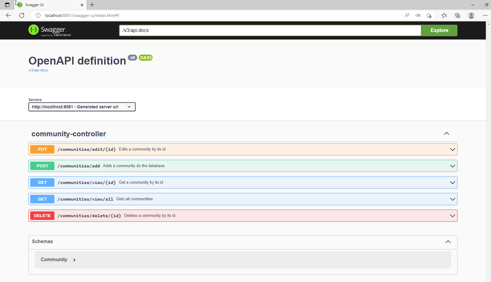

### Account
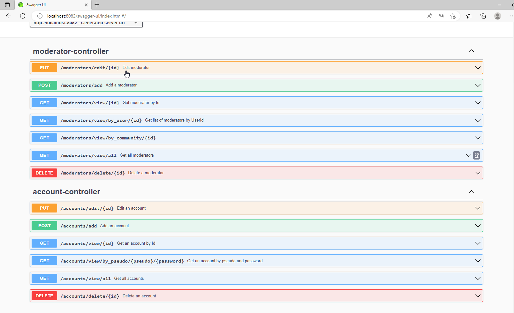

### Post
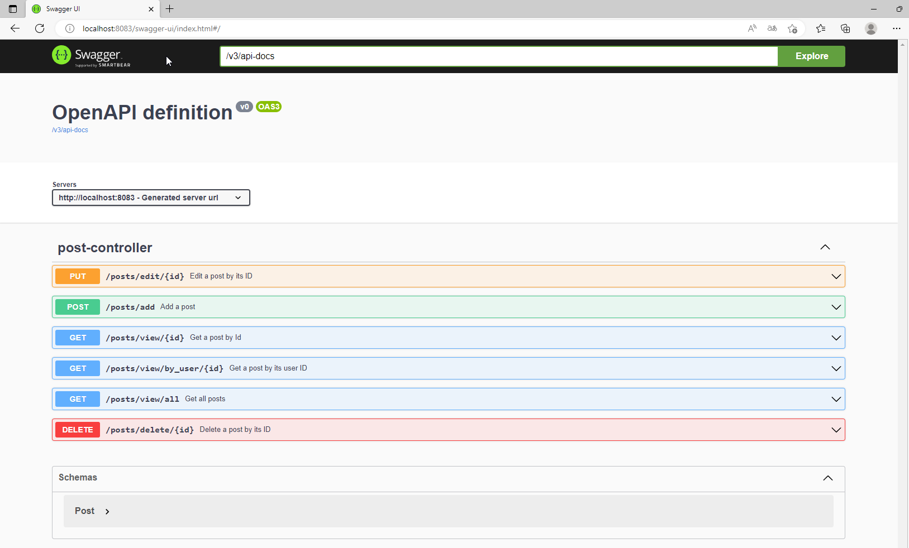


## Page connexion et création de compte pour l'application mobile avec Flutter
Nous avons créé deux premières pages pour l'interface graphique: la page de connexion et la page de création de compte. Les deux pages sont connectés au micro-service *ms_account* et permettent à un utilisateur de s'inscrire et de se connecter. 

### Account
Pour pouvoir communiquer avec l'API, il faut créer une entité *Account*
```dart
class Account {
  final int userId;
  final String userLastName;
  final String userFirstName;
  final String userEmail;
  final String userPseudo;
  final String userPassword;
  final DateTime userBirthday;

  const Account({
    required this.userId,
    required this.userLastName,
    required this.userFirstName,
    required this.userEmail,
    required this.userPseudo,
    required this.userPassword,
    required this.userBirthday,
  });

  // permet de transformer une entité en format json pour la communication avec l'API
  factory Account.fromJson(Map<String, dynamic> json) {
    return Account(
        userId: json['userId'],
        userLastName: json['userLastName'],
        userFirstName: json['userFirstName'],
        userEmail: json['userEmail'],
        userPseudo: json['userPseudo'],
        userPassword: json['userPassword'],
        userBirthday: json['userBirthday']);
  }
}
```

### Fichier configuration
Nous avons réuni les configurations communes entre plusieurs pages dans un fichier: *config.dart* afin de faciliter la lecture du code
```dart
import 'package:flutter/material.dart';
import 'package:google_fonts/google_fonts.dart';

class Configuration {
  static const appDarkBackgroundColor = Color.fromARGB(255, 31, 30, 30);
  static const orangeColor = Color(0xffff6633);

  static TextStyle textForApp(Color color, double fontSize) {
    return GoogleFonts.roboto(
        textStyle: TextStyle(
            fontWeight: FontWeight.bold,
            color: color,
            letterSpacing: .5,
            fontSize: fontSize));
  }

  static Container inputField(
      BuildContext context, TextEditingController controller, String hintText) {
    return Container(
      alignment: Alignment.center,
      child: SizedBox(
          height: 50,
          width: MediaQuery.of(context).size.width * 0.9,
          child: TextFormField(
            controller: controller,
            cursorColor: Colors.black,
            style: const TextStyle(color: Colors.white),
            decoration: InputDecoration(
              hintStyle: const TextStyle(color: Colors.white60),
              hintText: hintText,
              filled: true,
              fillColor: Colors.grey.shade700,
              border: OutlineInputBorder(
                  borderSide: BorderSide.none,
                  borderRadius: BorderRadius.circular(20)),
            ),
            validator: (String? value) {
              if (value == null || value.isEmpty) {
                return 'Please enter some text';
              }
              return null;
            },
          )),
    );
  }

  static Container passwordInput(
      BuildContext context, TextEditingController controller, String hintText) {
    return Container(
      alignment: Alignment.center,
      child: SizedBox(
        height: 50,
        width: MediaQuery.of(context).size.width * 0.9,
        child: TextFormField(
          obscureText: true,
          enableSuggestions: false,
          autocorrect: false,
          controller: controller,
          cursorColor: Colors.black,
          style: const TextStyle(color: Colors.white),
          decoration: InputDecoration(
            hintStyle: const TextStyle(color: Colors.white60),
            hintText: hintText,
            filled: true,
            fillColor: Colors.grey.shade700,
            border: OutlineInputBorder(
                borderSide: BorderSide.none,
                borderRadius: BorderRadius.circular(20)),
          ),
          validator: (String? value) {
            if (value == null || value.isEmpty) {
              return 'Please enter some text';
            }
            return null;
          },
        ),
      ),
    );
  }

  static ButtonStyle formButtonStyle(BuildContext context) {
    return ElevatedButton.styleFrom(
      backgroundColor: Colors.grey.shade800,
      minimumSize: Size(MediaQuery.of(context).size.width * 0.95, 45),
      padding: const EdgeInsets.symmetric(horizontal: 16.0),
      shape: const RoundedRectangleBorder(
        borderRadius: BorderRadius.all(Radius.circular(25.0)),
      ),
    );
  }
}
```
### Fichier utilities
Nous avons réuni des fonctions utiles à l'application dans un fichier *utilities.dart*

```dart
import 'dart:convert';
import 'package:flutter/material.dart' hide Key;
import 'package:http/http.dart' as http;
import 'package:interface_mobile/account.dart';

// Sources:
// How to use alert dialogs
// https://www.javatpoint.com/flutter-alert-dialogs

// Http request with flutter
// https://docs.flutter.dev/cookbook/networking/send-data
// https://docs.flutter.dev/cookbook/networking/fetch-data

// Hash text
// https://medium.flutterdevs.com/explore-encrypt-decrypt-data-in-flutter-576425347439

showAlertDialog(BuildContext context, String text) {
  // Create button
  Widget okButton = ElevatedButton(
    child: const Text("OK"),
    onPressed: () {
      Navigator.of(context).pop();
    },
  );

  // Create AlertDialog
  AlertDialog alert;
  alert = AlertDialog(
    title: const Text('Ohé!'),
    content: Text(text),
    actions: [
      okButton,
    ],
  );

  // show the dialog
  showDialog(
    context: context,
    builder: (BuildContext context) {
      return alert;
    },
  );
}

// connecter un utilisateur
Future<Account> userConnect(
    BuildContext context, String pseudo, String password) async {
  final response = await http.get(Uri.parse(
      'http://10.0.2.2:8082/accounts/view/by_pseudo/$pseudo/$password'));

  if (response.statusCode == 200) {
    showAlertDialog(context, "Connexion réussie");
    return Account.fromJson(jsonDecode(response.body));
  } else {
    showAlertDialog(context, "Erreur de connexion");
    throw Exception('Failed to connect');
  }
}

// créer un nouvel utilisateur
Future<Account> createUser(
    BuildContext context,
    String lastName,
    String firstName,
    String email,
    String pseudo,
    String password,
    String birthday) async {
  final response = await http.post(
    Uri.parse('http://10.0.2.2:8082/accounts/add'),
    headers: <String, String>{
      'Content-Type': 'application/json; charset=UTF-8',
    },
    body: jsonEncode(<String, String>{
      'userLastName': lastName,
      'userFirstName': firstName,
      'userEmail': email,
      'userPseudo': pseudo,
      'userPassword': password,
      'userBirthday': birthday
    }),
  );

  if (response.statusCode == 201) {
    showAlertDialog(context, "Compte créé avec succès");
    return Account.fromJson(jsonDecode(response.body));
  } else {
    throw Exception('Failed to create user.');
  }
}
```

### Page connexion

```dart
import 'package:flutter/gestures.dart';
import 'package:flutter/material.dart';
import 'package:interface_mobile/config.dart';
import 'package:interface_mobile/creationcompte.dart';
import 'package:interface_mobile/utilities.dart';

class ConnexionPage extends StatelessWidget {
  const ConnexionPage({super.key});

  @override
  Widget build(BuildContext context) {
    return Scaffold(
      backgroundColor: Configuration.appDarkBackgroundColor,
      appBar: AppBar(
        leading: IconButton(
            icon: const Icon(
              Icons.arrow_back,
            ),
            onPressed: () {}),
        title: const Center(
          child: Icon(
            Icons.anchor,
            color: Configuration.orangeColor,
          ),
        ),
        actions: <Widget>[
          Padding(
            padding: const EdgeInsets.fromLTRB(0, 15, 20, 0),
            child: Text.rich(TextSpan(children: [
              TextSpan(
                  style: Configuration.textForApp(Colors.white, 18),
                  text: "Sign up",
                  recognizer: TapGestureRecognizer()
                    ..onTap = () async {
                      Navigator.push(
                        context,
                        MaterialPageRoute(
                            builder: (context) => const CreationCompte()),
                      );
                    }),
            ])),
          )
        ],
        backgroundColor: Configuration.appDarkBackgroundColor,
      ),
      body: const SingleChildScrollView(child: ConnexionForm()),
    );
  }
}

class ConnexionForm extends StatefulWidget {
  const ConnexionForm({super.key});

  @override
  State<ConnexionForm> createState() => ConnexionFormState();
}

class ConnexionFormState extends State<ConnexionForm> {
  final GlobalKey<FormState> _formKey = GlobalKey<FormState>();
  final TextEditingController pseudoController = TextEditingController();
  final TextEditingController passwordController = TextEditingController();

  @override
  void dispose() {
    pseudoController.dispose();
    passwordController.dispose();
    super.dispose();
  }

  @override
  Widget build(BuildContext context) {
    return Form(
      key: _formKey,
      child: Column(
        crossAxisAlignment: CrossAxisAlignment.start,
        children: <Widget>[
          Padding(
              padding: const EdgeInsets.all(15),
              child: Center(
                child: Text('Log in to Hublot',
                    style: Configuration.textForApp(Colors.white, 25)),
              )),
          Padding(
              padding: const EdgeInsets.all(8),
              child: Configuration.inputField(
                  context, pseudoController, "Username")),
          Padding(
            padding: const EdgeInsets.all(8),
            child: Configuration.passwordInput(
                context, passwordController, "Password"),
          ),
          Padding(
            padding: const EdgeInsets.all(8),
            child: Text(
              'Forgot password',
              style: Configuration.textForApp(Configuration.orangeColor, 16),
            ),
          ),
          Padding(
            padding: const EdgeInsets.symmetric(vertical: 50.0),
            child: Center(
              child: ElevatedButton(
                style: Configuration.formButtonStyle(context),
                onPressed: () {
                  // si le formulaire est validé
                  if (_formKey.currentState!.validate()) {
                    var pseudo = pseudoController.text;
                    var password = passwordController.text;
                    userConnect(context, pseudo, password);
                  }
                },
                child: const Text('Continue'),
              ),
            ),
          ),
        ],
      ),
    );
  }
}
```

### Page création de compte
La création de compte est divisé sur deux pages

```dart
// Première page
import 'package:flutter/gestures.dart';
import 'package:flutter/material.dart';
import 'package:interface_mobile/config.dart';
import 'package:interface_mobile/creationcompteNext.dart';

import 'connexion.dart';

class CreationCompte extends StatelessWidget {
  const CreationCompte({super.key});

  @override
  Widget build(BuildContext context) {
    return Scaffold(
      backgroundColor: Configuration.appDarkBackgroundColor,
      appBar: AppBar(
        leading: IconButton(
            icon: const Icon(
              Icons.arrow_back,
            ),
            onPressed: () {}),
        title: const Center(
          child: Icon(
            Icons.anchor,
            color: Configuration.orangeColor,
          ),
        ),
        actions: <Widget>[
          Padding(
            padding: const EdgeInsets.fromLTRB(0, 15, 20, 0),
            child: Text.rich(TextSpan(children: [
              TextSpan(
                  style: Configuration.textForApp(Colors.white, 18),
                  text: "Log in",
                  recognizer: TapGestureRecognizer()
                    ..onTap = () async {
                      Navigator.push(
                        context,
                        MaterialPageRoute(
                            builder: (context) => const ConnexionPage()),
                      );
                    }),
            ])),
          )
        ],
        backgroundColor: Configuration.appDarkBackgroundColor,
      ),
      body: const SingleChildScrollView(child: CreationCompteForm()),
    );
  }
}

class CreationCompteForm extends StatefulWidget {
  const CreationCompteForm({super.key});

  @override
  State<CreationCompteForm> createState() => CreationCompteFormState();
}

class CreationCompteFormState extends State<CreationCompteForm> {
  final GlobalKey<FormState> _formKey = GlobalKey<FormState>();
  final TextEditingController pseudoController = TextEditingController();
  final TextEditingController passwordController = TextEditingController();

  @override
  void dispose() {
    pseudoController.dispose();
    passwordController.dispose();
    super.dispose();
  }

  @override
  Widget build(BuildContext context) {
    return Form(
      key: _formKey,
      child: Column(
        crossAxisAlignment: CrossAxisAlignment.start,
        children: <Widget>[
          Padding(
            padding: const EdgeInsets.all(8),
            child:
                Configuration.inputField(context, pseudoController, "Username"),
          ),
          Padding(
            padding: const EdgeInsets.all(8),
            child: Configuration.passwordInput(
                context, passwordController, "Password"),
          ),
          Padding(
              padding: const EdgeInsets.symmetric(vertical: 50.0),
              child: Center(
                child: ElevatedButton(
                  style: Configuration.formButtonStyle(context),
                  onPressed: () {
                    // Validate will return true if the form is valid, or false if
                    // the form is invalid.
                    if (_formKey.currentState!.validate()) {
                      Navigator.push(
                        context,
                        MaterialPageRoute(
                            builder: (context) => CreationCompteNext(
                                username: pseudoController.text,
                                password: passwordController.text)),
                      );
                    }
                  },
                  child: const Text('Next'),
                ),
              )),
        ],
      ),
    );
  }
}

```

```dart
// Deuxième page
import 'package:flutter/gestures.dart';
import 'package:flutter/material.dart';
import 'package:interface_mobile/config.dart';
import 'package:interface_mobile/utilities.dart';
import 'package:intl/intl.dart';

import 'connexion.dart';

// Sources
// Datepicker in Flutter
// https://www.fluttercampus.com/guide/39/how-to-show-date-picker-on-textfield-tap-and-get-formatted-date/

class CreationCompteNext extends StatelessWidget {
  const CreationCompteNext(
      {super.key, required this.username, required this.password});

  final String username;
  final String password;

  @override
  Widget build(BuildContext context) {
    return Scaffold(
      backgroundColor: Configuration.appDarkBackgroundColor,
      appBar: AppBar(
        leading: IconButton(
            icon: const Icon(
              Icons.arrow_back,
            ),
            onPressed: () {}),
        title: const Center(
          child: Icon(
            Icons.anchor,
            color: Configuration.orangeColor,
          ),
        ),
        actions: <Widget>[
          Padding(
            padding: const EdgeInsets.fromLTRB(0, 15, 20, 0),
            child: Text.rich(TextSpan(children: [
              TextSpan(
                  style: Configuration.textForApp(Colors.white, 18),
                  text: "Log in",
                  recognizer: TapGestureRecognizer()
                    ..onTap = () async {
                      Navigator.push(
                        context,
                        MaterialPageRoute(
                            builder: (context) => const ConnexionPage()),
                      );
                    }),
            ])),
          )
        ],
        backgroundColor: Configuration.appDarkBackgroundColor,
      ),
      body: SingleChildScrollView(
          child: CreationCompteNextForm(
        username: username,
        password: password,
      )),
    );
  }
}

class CreationCompteNextForm extends StatefulWidget {
  const CreationCompteNextForm(
      {super.key, required this.username, required this.password});

  final String username;
  final String password;

  @override
  State<CreationCompteNextForm> createState() => CreationCompteNextFormState();
}

class CreationCompteNextFormState extends State<CreationCompteNextForm> {
  final GlobalKey<FormState> _formKey = GlobalKey<FormState>();
  final TextEditingController lastNameController = TextEditingController();
  final TextEditingController firstNameController = TextEditingController();
  final TextEditingController emailController = TextEditingController();
  final TextEditingController pseudoController = TextEditingController();
  final TextEditingController passwordController = TextEditingController();
  final TextEditingController birthdayController = TextEditingController();

  @override
  Widget build(BuildContext context) {
    return Form(
      key: _formKey,
      child: Column(
        crossAxisAlignment: CrossAxisAlignment.start,
        children: <Widget>[
          Padding(
            padding: const EdgeInsets.all(8),
            child: Configuration.inputField(
                context, lastNameController, "Last Name"),
          ),
          Padding(
            padding: const EdgeInsets.all(8),
            child: Configuration.inputField(
                context, firstNameController, "First Name"),
          ),
          Padding(
            padding: const EdgeInsets.all(8),
            child: Configuration.inputField(context, emailController, "Email"),
          ),
          Padding(
            padding: const EdgeInsets.all(8),
            child: Container(
              alignment: Alignment.center,
              child: SizedBox(
                height: 50,
                width: MediaQuery.of(context).size.width * 0.9,
                child: TextFormField(
                  style: const TextStyle(color: Colors.white),
                  controller: birthdayController,
                  decoration: InputDecoration(
                      icon: Icon(
                        Icons.calendar_today,
                        color: Colors.grey.shade700,
                      ),
                      filled: true,
                      fillColor: Colors.grey.shade700,
                      border: OutlineInputBorder(
                          borderSide: BorderSide.none,
                          borderRadius: BorderRadius.circular(20)),
                      hintText: "Birthday",
                      hintStyle: const TextStyle(color: Colors.grey)),
                  readOnly:
                      true, //set it true, so that user will not able to edit text
                  onTap: () async {
                    DateTime? pickedDate = await showDatePicker(
                        context: context,
                        initialDate: DateTime.now(),
                        firstDate: DateTime(
                            1900), //DateTime.now() - not to allow to choose before today.
                        lastDate: DateTime.now());

                    if (pickedDate != null) {
                      String formattedDate =
                          DateFormat('yyyy-MM-dd').format(pickedDate);
                      setState(() {
                        birthdayController.text =
                            formattedDate; //set output date to TextField value.
                      });
                    } else {
                      showAlertDialog(
                          context, "Veuillez sélectionner une date.");
                    }
                  },
                ),
              ),
            ),
          ),
          Padding(
              padding: const EdgeInsets.symmetric(vertical: 50.0),
              child: Center(
                child: ElevatedButton(
                  style: Configuration.formButtonStyle(context),
                  onPressed: () {
                    // Validate will return true if the form is valid, or false if
                    // the form is invalid.
                    if (_formKey.currentState!.validate()) {
                      var lastName = lastNameController.text;
                      var firstName = firstNameController.text;
                      var email = emailController.text;
                      var pseudo = widget.username;
                      var password = widget.password;
                      var birthday = birthdayController.text;
                      createUser(context, lastName, firstName, email, pseudo,
                          password, birthday);
                    }
                  },
                  child: const Text('Create Account'),
                ),
              )),
        ],
      ),
    );
  }
}
```

### Sceenshots: résultats
Nous avons essayé de reproduire le plus possible l'application mobile Reddit.

#### Connexion
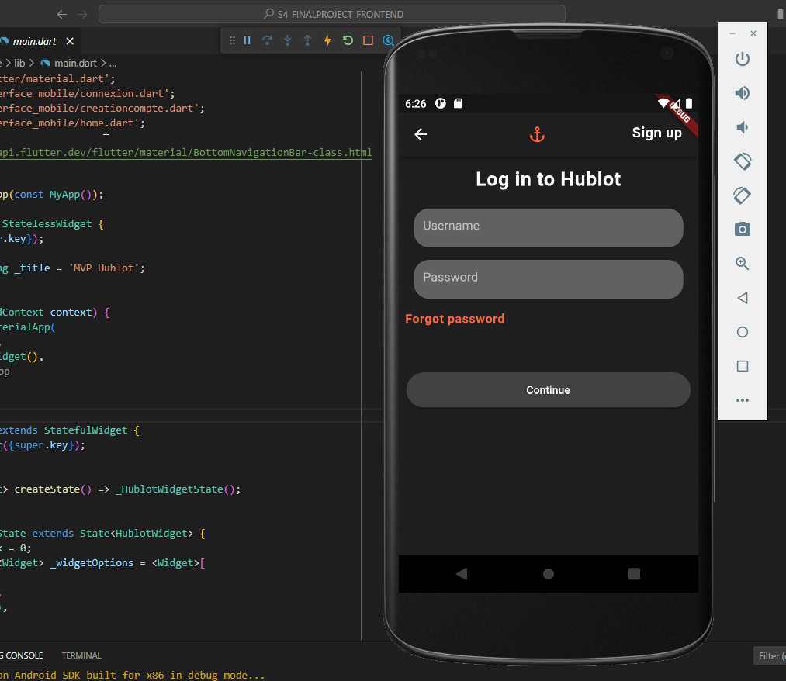

Si l'utilisateur existe dans la base de données, le résultat est le suivant:
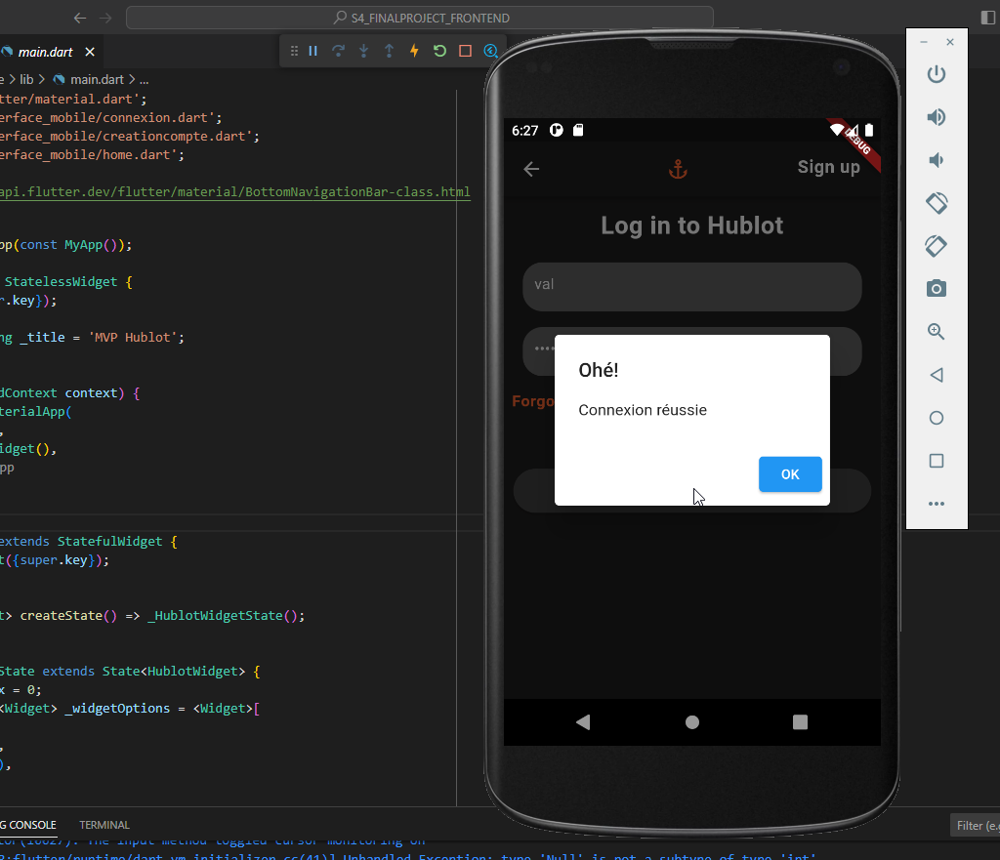

Si l'utilisateur n'existe pas dans la base données ou entre le mauvais mot de passe, le résultat est le suivant:
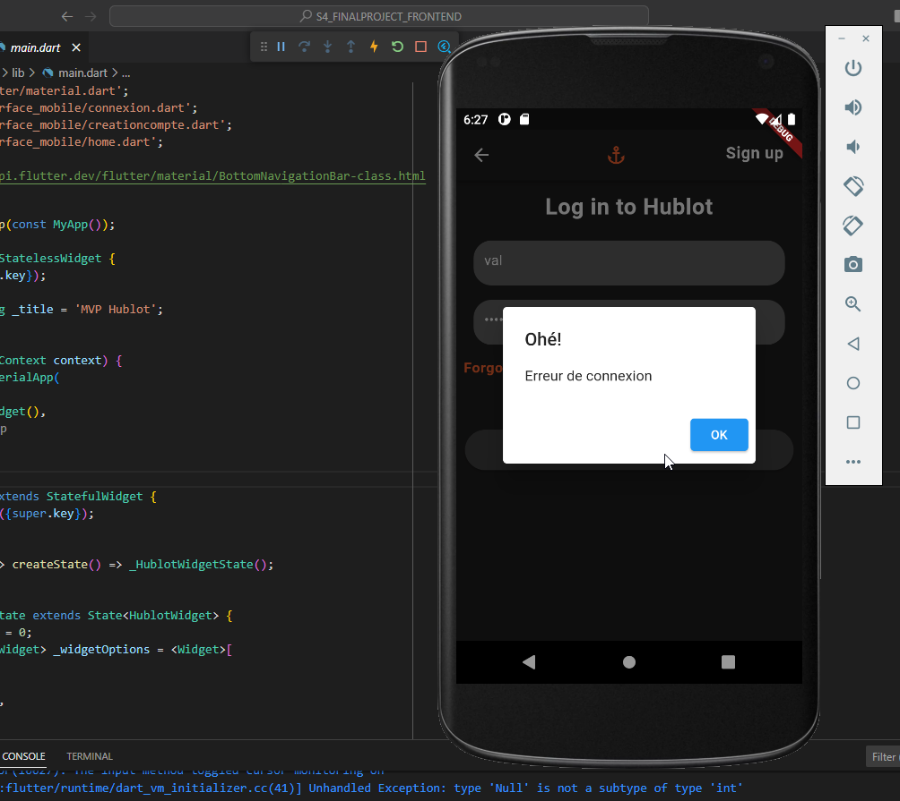

#### Création de compte
Voici la première page lors de la création d'un compte utilisateur:
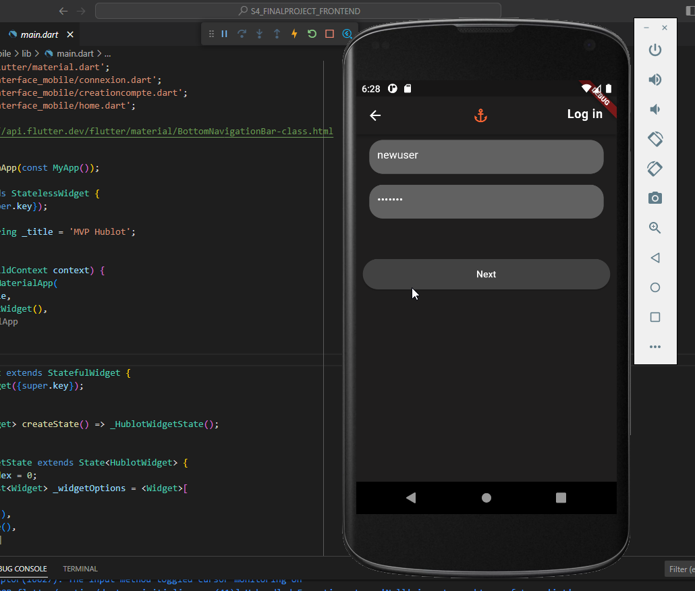

Voici la deuxième page lors de la création d'un compte utilisateur:
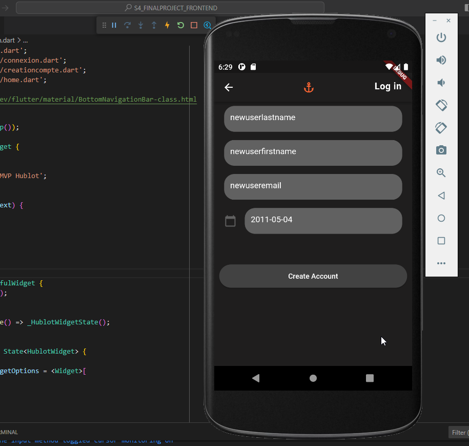

Quand un utilisateur est ajouté avec succès, voici ce qui arrive:
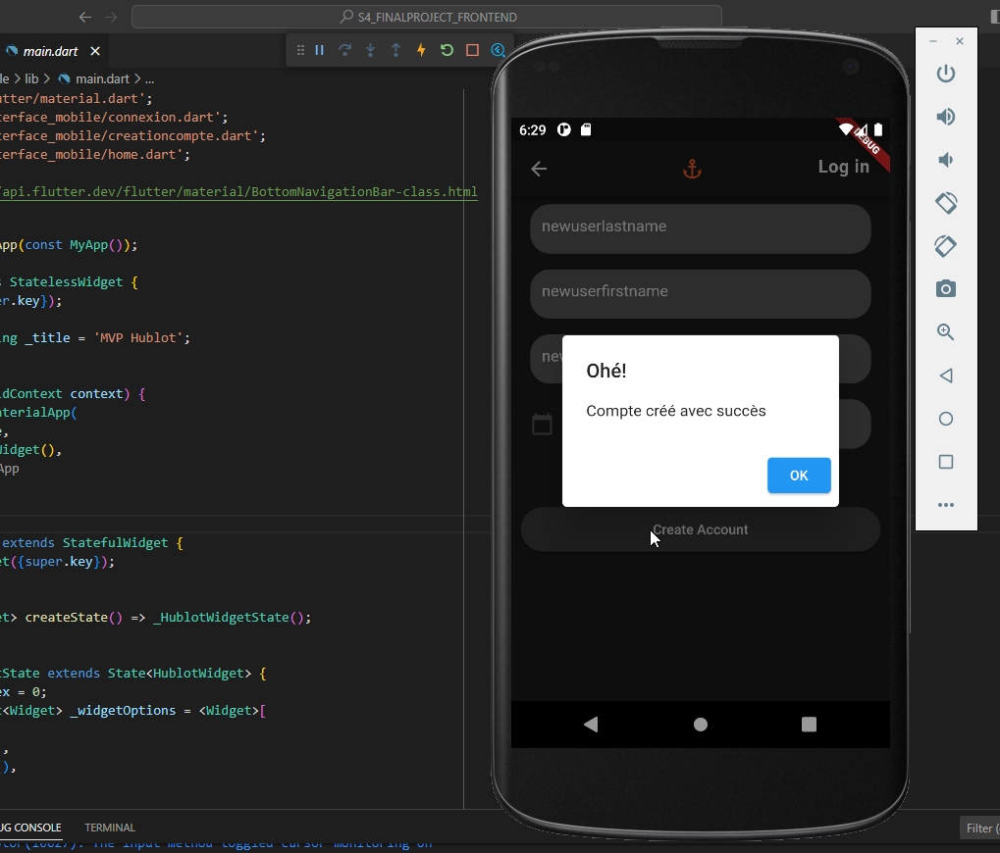

Quand nous allons vérifier dans la base de données, l'utilisateur est bien ajouté:
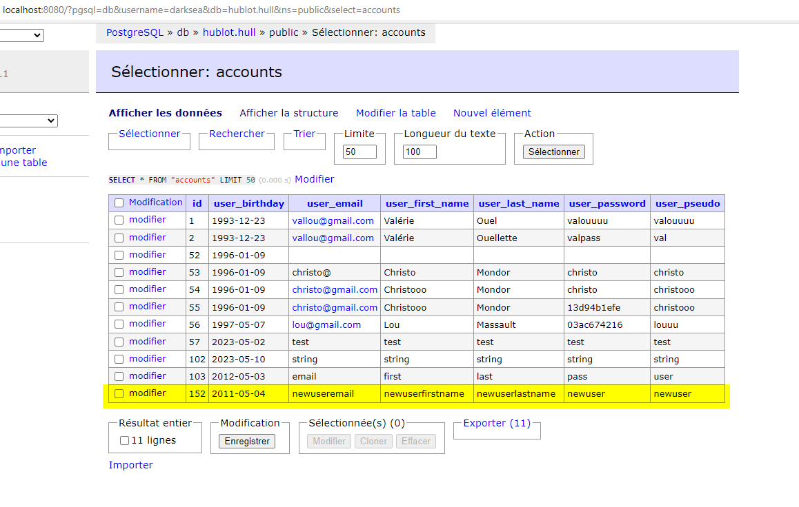


## Début du client web en Svelte
Nous utilisons un nouveau framework pour le développement du front-end. Sveltekit est un framework qui offre une alternative à react avec des fonctionnalités intéressante pour le développement d'applications de toutes les tailles et de tous les types.

D'abord, Svelte permet aux développeurs de choisir entre le *server side rendering* et le *client side rendering*, mais également de mélanger les deux pour offrir la meilleure expérience possible pour chaque cas de figure. Ensuite, Svelte offre une approche raffraichissante au *routing* client. En effet, en svelte, il suffit de créer une arborescence de dossier dans celui nommé *routing* pour créer des routes. Ainsi, un dossier nommé *about* dans le dossier *routing* va automatiquement créer une route vers */about* lors de l'exécution du projet. Ceci permet aussi l'application simple d'un *layout* à toutes les routes imbriquées. En effet, si un fichier *+layout.svelte* se trouve dans *routing*, les styles définis dans ce fichier seront appliqués à toutes les pages qui sont plus basses dans l'arborescence à moins qu'un autre *layout* soit définit dans une route particulière. Ceci permet également de placer des composants réutilisés par toutes les pages comme la barre de navigation et la barre de bas de page par exemple. Voici un exemple de notre structure de projet pour mieux comprendre, ainsi que le contenu de chaque fichier pour mettre l'emphase sur la force du framework.

Voir le site de SvelteKit pour plus d'informations : <https://kit.svelte.dev/>

### Structure du projet
Comme on peut le voir, ici nous avons seulement la page à la racine, mais on voit déjà l'utilisation de *+layout.svelte* qui va s'appliquer à *+page.svelte*. Le code pour chaque page de *routing* est ci-dessous.

#### Structure
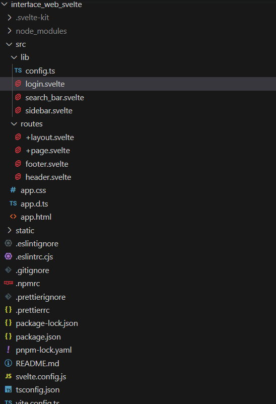

#### Layout
```html
<script lang="ts">
	import Header from './header.svelte';
	import Footer from './footer.svelte';

	import 'open-props/style';
	import 'open-props/normalize';
	import 'open-props/buttons';
	import 'iconify-icon';

	import '../app.css';
	import Sidebar from '../lib/sidebar.svelte';
</script>

<div class="layout">
	<div class="header">
		<Header />
	</div>

	<main>
		<div class="sidebar">
			<Sidebar />
		</div>

		<slot />
	</main>
</div>

<div class="footer">
	<Footer />
</div>

<style>
	.layout {
		height: 100%;
		display: grid;
		grid-template-rows: auto 1fr auto;
		margin-inline: auto;
		padding-inline: var(--size-0);
		background-color: #030303;
	}

	main {
		padding-block: var(--size-9);
		width: 100%;
		height: 100%;
		display: flex;
		position: fixed;
		z-index: 0;
	}

	.header {
		z-index: 1;
	}

	.sidebar {
		width: 15%;
		padding-left: 10px;
		padding-top: 20px;
		background-color: #1a1a1b;
	}

	.footer {
		text-align: center;
	}
</style>
```

#### Page
```html
<h1>Welcome to SvelteKit</h1>
<p>Visit <a href="https://kit.svelte.dev">kit.svelte.dev</a> to read the documentation</p>
```

#### Header
```html
<script lang="ts">
	import * as config from '$lib/config';
	import Login from '$lib/login.svelte';
	import SearchBar from '$lib/search_bar.svelte';
	import '../app.css';
</script>

<nav>
	<!-- Title -->
	<a href="/" class="title">
		<b>{config.title}</b>
		<!-- <p>{config.description}</p> -->
	</a>

	<!-- Search bar -->
	<SearchBar />

	<!-- Login -->
	<Login />
</nav>

<!-- Source: https://www.reddit.com -->

<style>
	nav {
		color: var(--text-2);
		align-items: center;
		display: inline-flex;
		flex-direction: row;
		flex-grow: 1;
		padding-block: var(--size-2);
		position: fixed;
		top: 0;
		width: 100%;
		height: 7%;
		padding-left: 1%;
		padding-right: 1%;
		border-bottom: 1px solid var(--gray-7);
	}

	a {
		color: inherit;
		text-decoration: none;
	}

	@media (min-width: 768px) {
		nav {
			display: flex;
			justify-content: space-between;
		}
	}
</style>
```

#### Footer
```html
<script lang="ts">
	import * as config from '$lib/config';
	import { CornerDownLeftIcon } from 'lucide-svelte';
	import '../app.css';
</script>

<div>
	<footer>
		<p>{config.title} &copy {new Date().getFullYear()}</p>
	</footer>
</div>

<style>
	footer {
		padding-block: var(--size-2);
		border-top: 1px solid var(--border);
	}

	p {
		color: var(--text-2);
		font-size: small;
	}
</style>
```

### L'utilisation du dossier lib
Dans svelte, les composants et les fichiers de configurations sont tous mis dans le dossier *lib* qui est ensuite accessible partout dans l'environnement en utilisant *$lib/nom_de_fichier.anything*.

#### Login
```html
<script lang="ts">
	import '../app.css';
</script>

<!-- Login -->
<div class="log-in-container">
	<a
		role="button"
		tabindex="0"
		href="https://www.reddit.com/login/?dest=https%3A%2F%2Fwww.reddit.com%2F"
		class="log-in-color">Log In</a
	>
</div>

<style>
	a:link {
		color: white;
	}

	.log-in-container {
		display: flex;
		align-items: center;
		justify-content: center;
		background-color: var(--orange-10);
		border: 1px solid transparent;
		border-radius: 1.25em;
		box-shadow: none;
		box-sizing: border-box;
		height: 36px;
		position: relative;
		min-width: 72px;
	}

	.log-in-color {
		display: flex;
		color: var(--text-1);
		text-decoration: none;
	}
</style>
```

#### Search bar
```html
<script>
	import '../app.css';
	import { Search } from 'lucide-svelte';
</script>

<div class="search-container">
	<div id="SearchDropdown" class="search-level-one rounded-box-container rounded-box">
		<div class="search-level-two">
			<form action="" method="get" role="search" class="search-form">
				<label for="header-search-bar" class="label-search">
					<div class="icon-container">
						<Search />
					</div>
				</label>
				<input
					type="search"
					class="header-search-input"
					id="header-search-bar"
					placeholder="Search Hublot"
					value
				/>
			</form>
		</div>
	</div>
</div>

<!-- Source: https://www.reddit.com -->

<style>
	.search-container {
		fill: aqua;
		flex-grow: 1;
		margin: 0 auto;
		max-width: 690px;
		padding-bottom: 6px;
	}

	.search-level-one {
		fill: aqua;
		-ms-flex-positive: 1;
		flex-grow: 1;
		margin-left: 16px;
		margin-right: 16px;
		width: auto;
		height: auto;
	}

	.rounded-box-container {
		border: 1px solid transparent;
		border-radius: 4px;
		box-sizing: border-box;
		height: 36px;
		position: relative;
		min-width: 72px;
	}

	.search-level-two {
		-ms-flex-align: center;
		align-items: center;
		box-sizing: border-box;
		background-color: var(--gray-9);
		border: 1px solid var(--gray-7);
		border-radius: 1.25em;
		box-shadow: none;
		height: 40px;
	}

	.search-form {
		width: 100%;
		height: 100%;
		display: flex;
	}

	.label-search {
		display: flex;
		cursor: default;
	}

	.header-search-input {
		appearance: none;
		color: var(--text-1);
		font-size: 14px;
		line-height: 14px;
		margin-right: 16px;
		outline: none;
		width: 100%;
		background-color: var(--gray-9);
	}

	.search-level-two:hover,
	.header-search-input:hover {
		background-color: var(--gray-11);
	}

	.search-level-two:hover {
		border: 1px solid var(--gray-5);
	}

	.icon-container {
		display: -ms-flexbox;
		display: flex;
		-ms-flex-align: center;
		align-items: center;
		padding: 0 9px 0 15px;
	}
</style>
```

#### Side bar
```html
<script>
	import { Home } from 'lucide-svelte';
	import '../app.css';
</script>

<!-- Side navigation -->

<!-- svelte-ignore a11y-missing-attribute -->
<p class="title">FEEDS</p>
<br />
<!-- svelte-ignore a11y-missing-attribute -->
<p class="categ">Home</p>
<!-- svelte-ignore a11y-missing-attribute -->
<p class="categ">Popular</p>
<br />

<!-- Source: https://www.w3schools.com/howto/howto_css_fixed_sidebar.asp -->

<style>
	.title {
		color: var(--text-2);
		font-size: small;
	}

	.categ {
		font-size: medium;
	}
</style>
```

### Utilisation de d'autres fonctionnalités de *Svelte*
Ici nous allons montrer un autre projet fait par un membre de l'équipe pour démontrer des outils utiles qui seront surement utilisés plus tard dans notre projet et pour démontrer notre compréhension des fonctionnalités de Svelte. Si vous pensez à la modification d'une variable dans un projet react par exemple, vous penserez surement à la fonctionalité *useState/setState*. Comme vous verrez dans l'exemple suivant, Svelte nous donne la possibilité d'utiliser directement la variable déclarée en javascript dans une balise html avec la propriété *bind*.

```html
<script lang="ts">
	let nbPersonnes: number = 0;
	let prixTotal: number;
	let sousTotal: number;
	let taxes: number;
	let pourboire: number;
	let taxesLivraison: number;
	let fraisLivraison: number;
	let fraisServices: number;
	let modePaiement: string = '';

	let name: Text;
	let price: number;

	let totalTest: number = 0;
	let result: string = '';

	let commandes = new Map();
	let our_shares = new Map();

	function total() {
		totalTest = 0;
		commandes.forEach((value: number, key: string) => {
			totalTest += value;
		});
	}

	function addSomeone() {
		commandes.set(name, price);
		commandes = commandes;
		nbPersonnes += 1;
		total();
	}

	function calculer() {
		result = '';
		console.log(
			taxesLivraison + '' + fraisLivraison + '' + fraisServices + '' + nbPersonnes + '' + sousTotal
		);
		let equalShareExtras =
			(taxesLivraison + fraisLivraison + fraisServices + pourboire) / nbPersonnes;
		commandes.forEach((value: number, key: string) => {
			let percentage_bill = value / sousTotal;
			let percentage_taxes = percentage_bill * taxes;
			let debt = value + percentage_taxes + equalShareExtras;
			our_shares.set(key, debt);
		});
		our_shares = our_shares;
	}
</script>

<h1>This playgroup pays it's debts!</h1>
<p>Hey la gang, hope the food was good!</p>
<br />

<input type="number" placeholder="Prix total" bind:value={prixTotal} /><br />
<input type="number" placeholder="Sous-total" bind:value={sousTotal} /><br />
<input type="number" placeholder="Taxes" bind:value={taxes} /><br />
<input type="number" placeholder="Taxes de livraison" bind:value={taxesLivraison} /><br />
<input type="number" placeholder="Frais de livraison" bind:value={fraisLivraison} /><br />
<input type="number" placeholder="Frais de service" bind:value={fraisServices} /><br />
<input type="number" placeholder="Pourboire" bind:value={pourboire} /><br />
<input type="Text" placeholder="Courriel ou tel." bind:value={modePaiement} /><br />
<br />
{#each [...commandes] as [key, value]}
	<div>{key} - {value}</div>
{/each}
<br />

<input type="Text" placeholder="Nom" bind:value={name} />
<input type="number" placeholder="Prix de la commande" bind:value={price} />
<button on:click={addSomeone}>Ajouter</button> <br />

<button on:click={calculer}>Calculer</button>

<br />

<h2>Nos dettes</h2>
{#each [...our_shares] as [key, value]}
	<p>{key} - {value.toFixed(2)} $</p>
{/each}

{#if modePaiement != ''}
	<p>Payer au: {modePaiement}</p>
{/if}
```

## Tous les micro-services sur *Docker*
Dans cette section nous allons présenter notre architecture *docker* avec notre fichier *docker* compose, notre registre de conteneur *docker hub* ainsi que notre environnement *Docker desktop*.

### Compose
```yaml
# Use postgres/example user/password credentials
version: "3.1"

services:
  db:
    image: postgres
    container_name: db
    restart: always
    environment:
      POSTGRES_USER: darksea
      POSTGRES_PASSWORD: root
      POSTGRES_DB: hublot.hull
    healthcheck:
      test: ["CMD-SHELL", "pg_isready -U $$POSTGRES_USER -d $$POSTGRES_DB"]
      interval: 1s
    expose:
      - "5432"
    ports:
      - "5432:5432"
    networks:
      - darksea
    volumes:
      - data:/var/lib/postgresql/data

  adminer:
    image: adminer:4.8.1
    container_name: adminer
    restart: always
    ports:
      - 8080:8080
    networks:
      - darksea

  consul-container:
    container_name: consul-container
    hostname: "consul-container"
    image: consul
    command: agent -server -ui -node=server1 -bootstrap-expect=1 -client=0.0.0.0
    environment:
      - CONSUL_BIND_INTERFACE=eth0
    ports:
      - "8500:8500"
      - "8600:8600/udp"
      - "8600:8600/tcp"
    networks:
      - darksea

  ms_community:
    image: darkseacollective/ms_community:version1.1
    container_name: ms_community
    ports:
      - "8081:8081"
    networks:
      - darksea
    environment:
      - SPRING_DATASOURCE_URL=jdbc:postgresql://db:5432/hublot.hull
      - SPRING_DATASOURCE_USERNAME=darksea
      - SPRING_DATASOURCE_PASSWORD=root
      - SPRING_JPA_HIBERNATE_DDL_AUTO=update
      - WAIT_FOR_HOSTS=consul-container:8500
    depends_on:
      db:
        condition: service_healthy
      consul-container:
        condition: service_started

  ms_account:
    image: darkseacollective/ms_account:version1.2
    container_name: ms_account
    ports:
      - "8082:8082"
    networks:
      - darksea
    environment:
      - SPRING_DATASOURCE_URL=jdbc:postgresql://db:5432/hublot.hull
      - SPRING_DATASOURCE_USERNAME=darksea
      - SPRING_DATASOURCE_PASSWORD=root
      - SPRING_JPA_HIBERNATE_DDL_AUTO=update
      - WAIT_FOR_HOSTS=consul-container:8500
    depends_on:
      db:
        condition: service_healthy
      consul-container:
        condition: service_started

  ms_post:
    image: darkseacollective/ms_post:version1.0
    container_name: ms_post
    ports:
      - "8083:8083"
    networks:
      - darksea
    environment:
      - SPRING_DATASOURCE_URL=jdbc:postgresql://db:5432/hublot.hull
      - SPRING_DATASOURCE_USERNAME=darksea
      - SPRING_DATASOURCE_PASSWORD=root
      - SPRING_JPA_HIBERNATE_DDL_AUTO=update
      - WAIT_FOR_HOSTS=consul-container:8500
    depends_on:
      db:
        condition: service_healthy
      consul-container:
        condition: service_started

networks:
  darksea:
    driver: bridge

volumes:
  data:
```

### Registre Docker hub
Ce registre public permet à tout le monde d'utiliser notre *Docker compose file* pour déployer notre *backend* sur leur machine en assumant qu'iels ont *docker* et *docker compose* d'installer sur leurs machines.

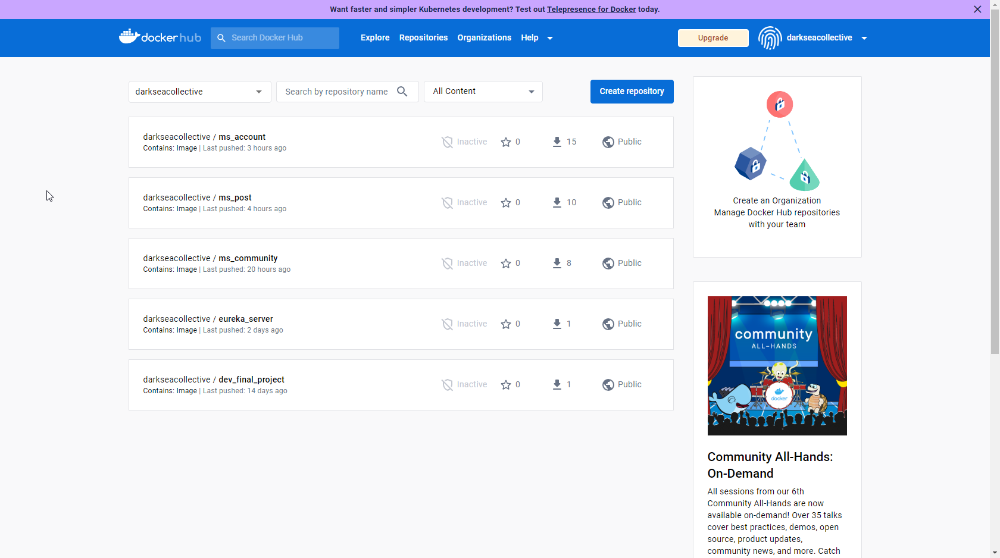

En utilisant simplement le nom de notre registre et le nom de l'image désirée, vous pouvez utiliser les images individuelles dans vos propres projets *Docker*.

### Environnement Docker Desktop
L'environnement graphique *Docker* facilite grandement le développement de notre projet.

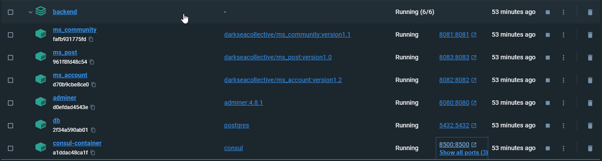

## Utilisation de consul et adminer
### Consul
*Consul* est un service permettant de garder un registre de nos services, comme *eureka* qui avait été présenté en classe. L'avantage de *Consul* c'est qu'il offre la possibilité de développer le service sous *Kubernetes* pour offrir une *api gateway* basée sur les informations du registres. Nous allons tenter de déployer le projet sous cette forme pour le livrable 3.

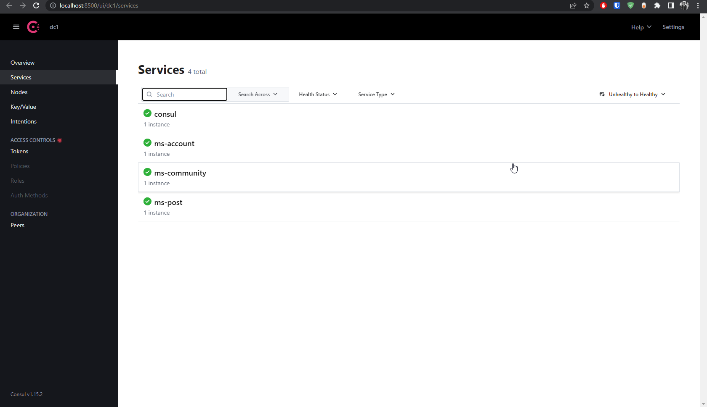

### Adminer
*Adminer* a remplacé *pgadmin* dans notre architecture parce que ce dernier avait des difficultés au niveau du déploiement en docker à cause de problèmes de droits d'accès réseau. L'interface de ce nouvel outil est plus simple, mais toute aussi puissante pour les besoin de notre déploiement. On a accès à des outils de gestion et nous pouvons facilement voir les données stockées dans notre base de données lors de l'exécution de nos services. 

#### Adminer page d'accueil

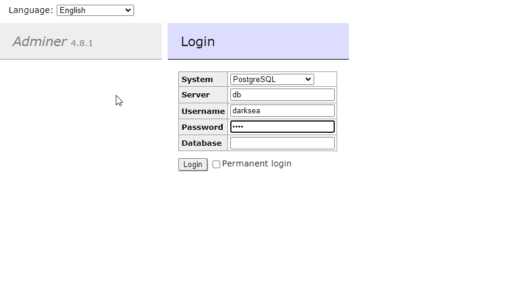

#### Adminer database selector

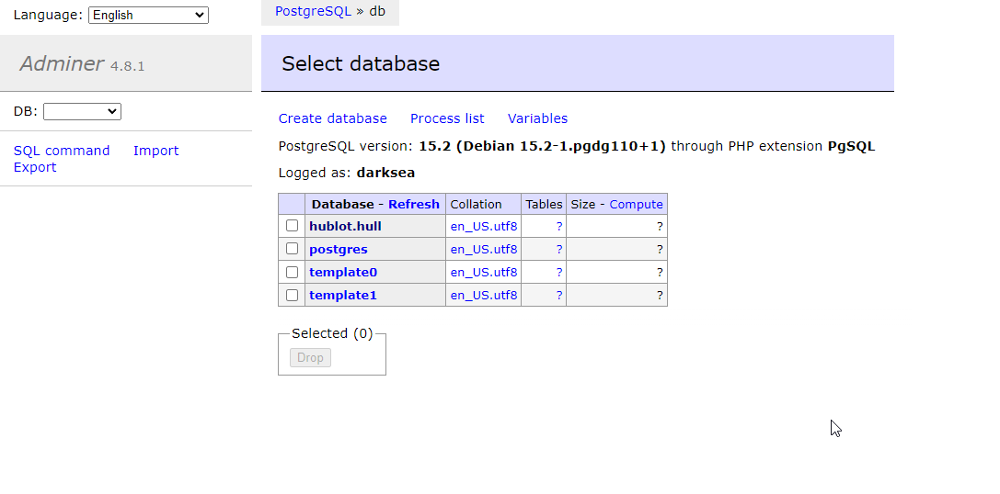

#### Adminer database dashboard

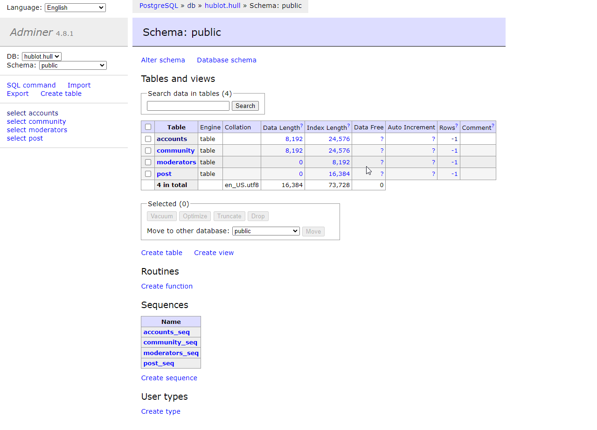

#### Adminer data viewer

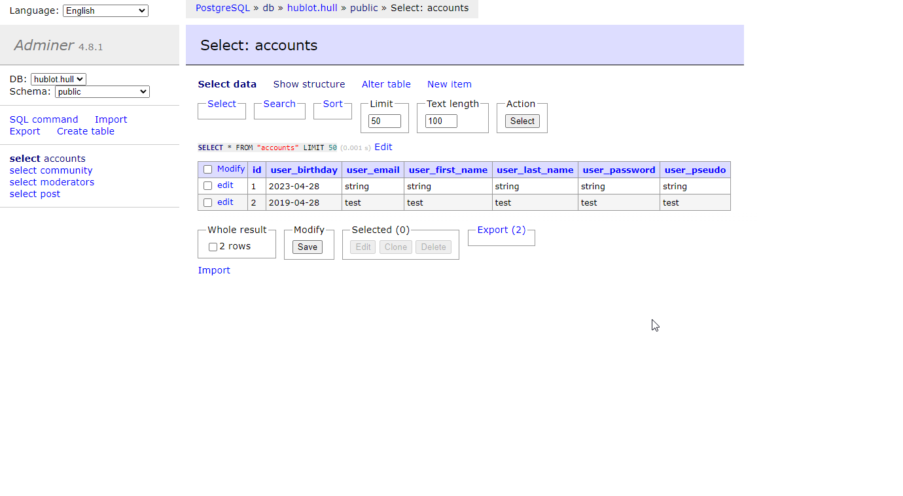