# Livrable 3

Pour le troisième livrable, nous allons livrer les parties suivantes de notre application:

1. Une documentation complète pour le projet
   1. Client web utilisant les fonctionnalités de chaque microservices
   2. Client mobile utilisant les fonctionnalités de chaque microservices
   3. Une version docker des microservices pour un déploiement simple
2. Un guide utilisateur.ice et un guide de développement sous format vidéo
3. Une section d'améliorations futures et d'instrospection sur le projet

- [Livrable 3](#livrable-3)
- [Documentation complète pour le projet](#documentation-complète-pour-le-projet)
  - [Client Web](#client-web)
    - [Concept utiles en svelte](#concept-utiles-en-svelte)
    - [Techniques d'architecture](#techniques-darchitecture)
    - [Utilisation du client web](#utilisation-du-client-web)
    - [Aide visuelle pour le web](#aide-visuelle-pour-le-web)
      - [Page d'accueil light mode](#page-daccueil-light-mode)
      - [Page d'accueil dark mode (exemple 1)](#page-daccueil-dark-mode-exemple-1)
      - [Page d'accueil dark mode (exemple 2)](#page-daccueil-dark-mode-exemple-2)
      - [Création de compte (1)](#création-de-compte-1)
      - [Création de compte (2)](#création-de-compte-2)
      - [Connexion](#connexion)
      - [Page d'accueil connectée](#page-daccueil-connectée)
      - [Création de post](#création-de-post)
      - [Création de communauté](#création-de-communauté)
      - [Page communauté](#page-communauté)
  - [Client Mobile](#client-mobile)
    - [Utilisation du client mobile](#utilisation-du-client-mobile)
    - [Aide visuelle pour le mobile](#aide-visuelle-pour-le-mobile)
      - [Page Connexion](#page-connexion)
      - [Page Create post](#page-create-post)
      - [Page Home](#page-home)
  - [Microservices](#microservices)
    - [Code](#code)
      - [Controller](#controller)
      - [Model](#model)
      - [Repository](#repository)
      - [Application](#application)
      - [application.properties](#applicationproperties)
      - [DockerFile](#dockerfile)
    - [Exporter le tout vers votre repo dockerhub pour utilisation ultérieure](#exporter-le-tout-vers-votre-repo-dockerhub-pour-utilisation-ultérieure)
    - [Docker compose](#docker-compose)
    - [Aide visuelle pour le backend](#aide-visuelle-pour-le-backend)
      - [État de docker desktop après la commande docker compose up](#état-de-docker-desktop-après-la-commande-docker-compose-up)
      - [Consul après initialisation de tous les services](#consul-après-initialisation-de-tous-les-services)
      - [Adminer - votre page d'accueil pour l'utilisation de cet outil de gestion de base de donnée](#adminer---votre-page-daccueil-pour-lutilisation-de-cet-outil-de-gestion-de-base-de-donnée)
      - [Adminer - votre page d'accueil pour l'utilisation de cet outil de gestion de base de donnée](#adminer---votre-page-daccueil-pour-lutilisation-de-cet-outil-de-gestion-de-base-de-donnée-1)
      - [Microservice - community, swagger](#microservice---community-swagger)
      - [Microservice - post, swagger](#microservice---post-swagger)
      - [Microservice - account, swagger](#microservice---account-swagger)
      - [Notes sur les instructions](#notes-sur-les-instructions)
- [Guides](#guides)
  - [Guide d'utilisateur.ice](#guide-dutilisateurice)
    - [Mobile](#mobile)
  - [Guide de développement](#guide-de-développement)
    - [Étapes d'installation](#étapes-dinstallation)
      - [Partie Mobile](#partie-mobile)
      - [Partie Web](#partie-web)
- [Améliorations futures et intropections sur le projet](#améliorations-futures-et-intropections-sur-le-projet)

# Documentation complète pour le projet

## Client Web

### Concept utiles en svelte

Nous le verrons plus dans le guide développeur, mais svelte offre plusieurs avantages sur d'autres framework, particulièrement l'option de render de l'information du côté serveur et du côté client ou de un ou l'autre. À l'aide des fichier +page.ts et +page.server.ts nous pouvons choisir ce qui est exécuter par le serveur ou par le client avant de télécharger et d'afficher les informations de la page. Voici un exemple où on demande au serveur de trouver toutes les communautés.

```typescript
import { communityUrl } from "$lib/config";

/** @type {import('./$types').PageServerLoad} */
export async function load({ params }) {
  let community = null;
  const url = communityUrl + "communities/get/" + params.communityName;
  const response = await fetch(url);
  community = await response.json();
  console.log(community);

  return {
    community,
  };
}
```

Le routing client en svelte est impressionant, nous permettant de structurer le projet simplement sous forme d'arborescence de dossier et d'ensuite utiliser un simple tag html a avec un lien vers un autre dossier pour créer le comportement du routing client. Voici l'exemple de la structure des routes et un appel à ces routes dans le code.

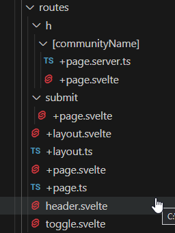

```html
{#if propValue != null} {#each propValue as community}
<a
  role="menuitem"
  class="sidebar-menu-link"
  tabindex="-1"
  aria-label="./"
  href="/h/{community.communityName}"
>
  <i class="sidebar-icons icon"><Trophy /></i>
  <span class="sidebar-items-text">h/{community.communityName}</span>
</a>
{/each} {/if}
```

Comme on le voit ici, svelte est un puissant outil de développement front-end. En effet, on utilise à la fois ses avantages de routing en appelant seulement le lien href de la même manière que l'arborescence vu plus haut, mais en plus on peut utiliser une variable définie dans le script (community) avec l'usage des braquettes {} pour compléter la route. En effet, en svelte on peut créer des routes avec des paramètres très facilement en donnant une slug (nom utilisé pour décrire le paramètre url d'une route) à notre dossier en utilisant les braquettes []! Ici la slug est nommée communityName et est accessible par les paramètres de l'url comme dans le code ci-dessus ou ont trouvait les communautés (voir l'utilisation de params).

### Techniques d'architecture

Nous avons utiliser le concept de classes en css pour créer des variables de couleur utilisable partout sur notre client web. L'avantage de cette approche est de permettre aux développeur d'utiliser les mêmes noms de variables sur plusieurs composants et de changer le thème du site en entier rapidement. Dans le fichier app.css vous trouverez des exemples de ces variables et leur usage dans notre cas pour offrir un thème clair et un thème sombre au simple clic d'un bouton. Voici le code.

```css
@import "@fontsource/manrope";
@import "@fontsource/jetbrains-mono";

html {
  /* font */
  --font-sans: Verdana, arial, "Manrope", sans-serif;
  --font-mono: Verdana, arial, "JetBrains Mono", monospace;

  /* dark */
  --title-dark: #d7dadc;
  --brand-dark: var(--orange-3);
  --text-1-dark: var(--gray-3);
  --text-2-dark: #757575;
  --main-text-dark: white;
  --surface-1-dark: var(--gray-12);
  --surface-2-dark: var(--gray-11);
  --surface-3-dark: var(--gray-10);
  --surface-4-dark: var(--gray-9);
  --background-dark: black;
  --header-background-dark: #1a1a1b;
  --border-dark: var(--gray-9);
  --sidebar-background-dark: #1a1a1b;
  --searchbar-background-color-dark: #272729;
  --reg-border-color-dark: grey;
  --hover-border-color-dark: white;
  --hover-sidebar-dark: #232324;
  --back-to-top-btn-dark: #0079d3;
  /* --back-to-top-btn-hover-dark: #e4e6e7; */
  --hublot-body-dark: #1a1a1b;
  --hublot-line-dark: #343536;
  --new-hublot-field-dark: #272729;
  --new-hublot-line-dark: #343536;
  --new-hublot-votes-dark: rgba(18, 18, 19, 0.8);

  /* light */
  --title-light: black;
  --brand-light: var(--orange-10);
  --text-1-light: var(--gray-8);
  --text-2-light: #757575;
  --main-text-light: black;
  --surface-1-light: #dae0e6;
  --surface-2-light: var(--gray-1);
  --surface-3-light: var(--gray-2);
  --surface-4-light: var(--gray-3);
  --background-light: rgb(219, 224, 230);
  --header-background-light: white;
  --border-light: var(--gray-4);
  --sidebar-background-light: white;
  --searchbar-background-color-light: #f6f7f8;
  --reg-border-color-light: grey;
  --hover-border-color-light: #0079d3;
  --hover-sidebar-light: #f5f5f5;
  --back-to-top-btn-light: #0079d3;
  /* --back-to-top-btn-hover-light: #e4e6e7; */
  --hublot-body-light: #ffffff;
  --hublot-line-light: #edeff1;
  --new-hublot-field-light: #f6f7f8;
  --new-hublot-line-light: #edeff1;
  --new-hublot-votes-light: rgba(255, 255, 255, 0.8);
}

:root {
  color-scheme: dark;

  --title: var(--title-dark);
  --brand: var(--brand-dark);
  --text-1: var(--text-1-dark);
  --text-2: var(--text-2-dark);
  --main-text: var(--main-text-dark);
  --surface-1: var(--surface-1-dark);
  --surface-2: var(--surface-2-dark);
  --surface-3: var(--surface-3-dark);
  --surface-4: var(--surface-4-dark);
  --background: var(--background-dark);
  --border: var(--border-dark);
  --sidebar-background: var(--sidebar-background-dark);
  --header-background: var(--header-background-dark);
  --searchbar-background-color: var(--searchbar-background-color-dark);
  --reg-border-color: var(--reg-border-color-dark);
  --hover-border-color: var(--hover-border-color-dark);
  --hover-sidebar: var(--hover-sidebar-dark);
  --back-to-top-btn: var(--back-to-top-btn-dark);
  /* --back-to-top-btn-hover: var(--back-to-top-btn-hover-dark) ; */
  --hover-sidebar: var(--hover-sidebar-dark);
  --hublot-body: var(--hublot-body-dark);
  --hublot-line: var(--hublot-line-dark);
  --new-hublot-field: var(--new-hublot-field-dark);
  --new-hublot-line: var(--new-hublot-line-dark);
  --new-hublot-votes: var(--new-hublot-votes-dark);
}

@media (prefers-color-scheme: light) {
  :root {
    color-scheme: light;

    --title: var(--title-light);
    --brand: var(--brand-light);
    --text-1: var(--text-1-light);
    --text-2: var(--text-2-light);
    --main-text: var(--main-text-light);
    --surface-1: var(--surface-1-light);
    --surface-2: var(--surface-2-light);
    --surface-3: var(--surface-3-light);
    --surface-4: var(--surface-4-light);
    --background: var(--background-light);
    --border: var(--border-light);
    --sidebar-background: var(--sidebar-background-light);
    --header-background: var(--header-background-light);
    --searchbar-background-color: var(--searchbar-background-color-light);
    --reg-border-color: var(--reg-border-color-light);
    --hover-border-color: var(--hover-border-color-light);
    --hover-sidebar: var(--hover-sidebar-light);
    --back-to-top-btn: var(--back-to-top-btn-light);
    /* --back-to-top-btn-hover: var(--back-to-top-btn-hover-light) ; */
    --hublot-body: var(--hublot-body-light);
    --hublot-line: var(--hublot-line-light);
    --new-hublot-field: var(--new-hublot-field-light);
    --new-hublot-line: var(--new-hublot-line-light);
    --new-hublot-votes: var(--new-hublot-votes-light);
  }
}

[color-scheme="dark"] {
  color-scheme: dark;

  --title: var(--title-dark);
  --brand: var(--brand-dark);
  --text-1: var(--text-1-dark);
  --text-2: var(--text-2-dark);
  --main-text: var(--main-text-dark);
  --surface-1: var(--surface-1-dark);
  --surface-2: var(--surface-2-dark);
  --surface-3: var(--surface-3-dark);
  --surface-4: var(--surface-4-dark);
  --background: var(--background-dark);
  --border: var(--border-dark);
  --sidebar-background: var(--sidebar-background-dark);
  --header-background: var(--header-background-dark);
  --searchbar-background-color: var(--searchbar-background-color-dark);
  --hover-sidebar: var(--hover-sidebar-dark);
  --hublot-body: var(--hublot-body-dark);
  --hublot-line: var(--hublot-line-dark);
  --new-hublot-field: var(--new-hublot-field-dark);
  --new-hublot-line: var(--new-hublot-line-dark);
  --new-hublot-votes: var(--new-hublot-votes-dark);
}

[color-scheme="light"] {
  color-scheme: light;

  --title: var(--title-light);
  --brand: var(--brand-light);
  --text-1: var(--text-1-light);
  --text-2: var(--text-2-light);
  --main-text: var(--main-text-light);
  --surface-1: var(--surface-1-light);
  --surface-2: var(--surface-2-light);
  --surface-3: var(--surface-3-light);
  --surface-4: var(--surface-4-light);
  --background: var(--background-light);
  --border: var(--border-light);
  --sidebar-background: var(--sidebar-background-light);
  --header-background: var(--header-background-light);
  --searchbar-background-color: var(--searchbar-background-color-light);
  --hover-sidebar: var(--hover-sidebar-light);
  --new-hublot-field: var(--new-hublot-field-light);
  --new-hublot-line: var(--new-hublot-line-light);
  --new-hublot-votes: var(--new-hublot-votes-light);
  --hover-sidebar: var(--hover-sidebar-light);
  --hublot-body: var(--hublot-body-light);
  --hublot-line: var(--hublot-line-light);
}
```

Nous avons également utiliser certains avantages de sveltekit pour accéder à nos composants et nos images. En effet, en svelte c'est très facile d'importer toutes les ressources dans le dossier lib en utilisant le symbole $ et le mot lib. Voici un exemple où on importe plusieurs composants de lib pour construire notre layout.

```html
<script lang="ts">
  import Header from "./header.svelte";

  import "iconify-icon";
  import "open-props/buttons";
  import "open-props/normalize";
  import "open-props/style";

  import ModalCreateAccount from "$lib/modal_create_account.svelte";
  import ModalCreateAccountNext from "$lib/modal_create_account_next.svelte";
  import ModalCreateCommunity from "$lib/modal_create_community.svelte";
  import ModalLogin from "$lib/modal_login.svelte";
  import "../app.css";
  import Sidebar from "../lib/sidebar.svelte";

  let communities: any;
  /** @type {import('./$types').PageData} */
  export let data;
  if (data != null) {
    communities = data.communities;
  }
</script>
```

### Utilisation du client web

Pour l'application web, nous avons étoffé l'interface commencée dans le livrable 2.

Lors du lancement de l'application, nous arrivons sur une page d'accueil qui contient les éléments suivants :

- un header : logo, nom du site, barre de recherche (non fonctionnelle), bouton _Log in_ pour se connecter, icones soleil/lune pour régler le thème du site a dark ou light (fonctionnel)
- une sidebar à gauche : lien vers l'accueil (Home), liens vers différentes commuunautés, bouton _Sign in_ pour se créer un compte
- un thread central contenant les posts présents dans la base de données

L'utilisateur a la possibilité de naviguer sur le site sans se connecter et accéder à toutes les communautés et tous les posts. Néanmoins, s'il souhaite créer un post ou un communauté, il est nécessaire de se créer un compte.

Le bouton _Sign in_ dans la sidebar ouvre une petite fenêtre avec un formulaire pour recueillir les informations du nouvel utilisateur (nom, prénom, date de naissance, pseudo, mot de passe, etc). Une fois le compte créé, l'utilisateur retrouve la page d'accueil légrement modifiée :

- le pseudo est affiché à droite dans le header
- le bouton _Sign in_ n'apparaît plus
- le bouton _Log in_ est remplacé par un bouton _Log out_ pour se déconnecter
- un encart apparaît à droite du thread de posts avec un petit mot de bienvenue et 2 boutons pour créer un post et créer une communauté.

Le bouton _Create a post_ (fonctionnel) renvoie a une nouvelle page ou l'utilisateur peut écrire son post (titre, contenu, image, etc). Il y a un menu qui permet de choisir la communauté dans laquelle publier (non fonctionnel). Il y a également un bouton _Save draft_ pour sauvegarder le post en brouillon (non fonctionnel) et un bouton pour publier le post (fonctionnel). Après la publication, l'utilisateur est renvoyé automatiquement à la page d'accueil ou il retrouvera le post nouvellement créé à la suite des autres posts.

Le bouton _Create a community_ (fonctionnel) ouvre une petite fenêtre avec un formulaire pour recueillir les informations de la nouvelle communauté (nom, description). Une fois créée, l'utilisateur est envoyé sur la page de la communauté créée.

Le bouton _Log in_ (fonctionnel) permet à l'utilisateur de se connecter si son compte est existant dans la base de données. Si le pseudo ou le mot de passe ne correspond pas, un message d'erreur est affiché. Une fois connecté, l'utilisateur retrouve la même page d'accueil modifiée qu'après une création de nouveau compte.

Le bouton _Log out_ (fonctionnel) permet à l'utilisateur de se déconnecter.

Dans le thread central de la page, chaque post affiche un titre, contenu, image, nom du créateur du post (non fonctionnel), communauté d'appartenance (non fonctionnel) et date de publication.
Il est possible de supprimer un post en cliquant sur le bouton _Delete_ (fonctionnel) au bas du post. Il est également possible de cliquer les flèches haut pour 'upvoter' le post et bas pour le 'downvoter' (même principe que sur Reddit).

### Aide visuelle pour le web

#### Page d'accueil light mode


Le mode -light ou dark- peut être modifié à l'aide des icônes de soleil et de lune en haut à droite de la page.

#### Page d'accueil dark mode (exemple 1)

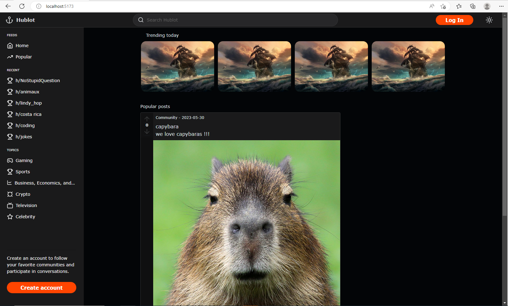

#### Page d'accueil dark mode (exemple 2)

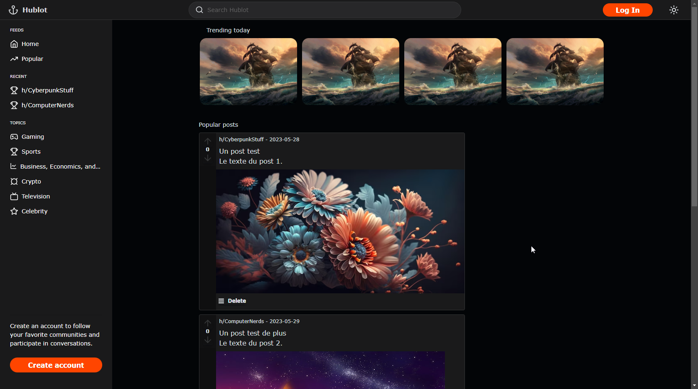

#### Création de compte (1)

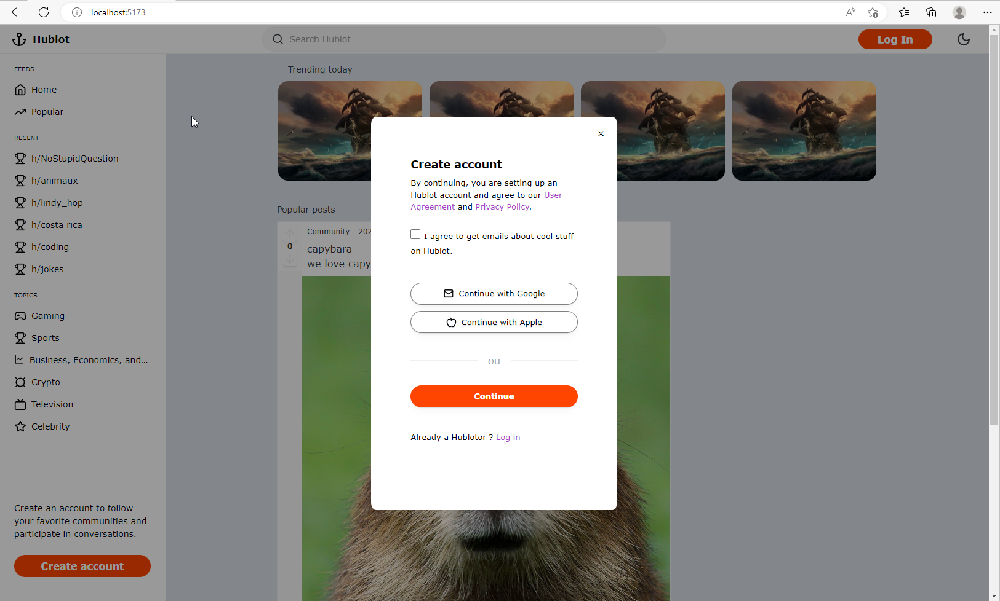

#### Création de compte (2)

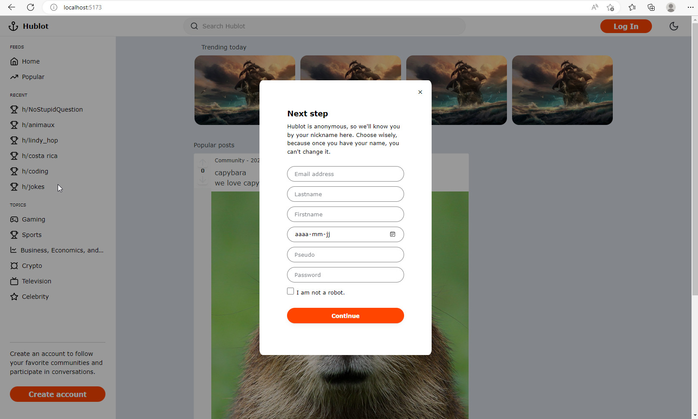

#### Connexion


#### Page d'accueil connectée

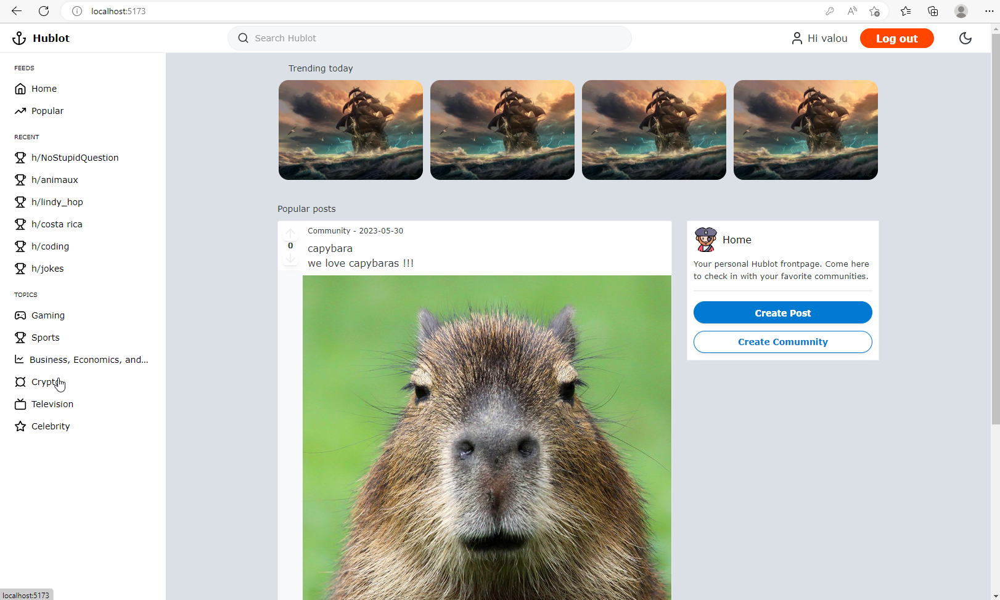

#### Création de post

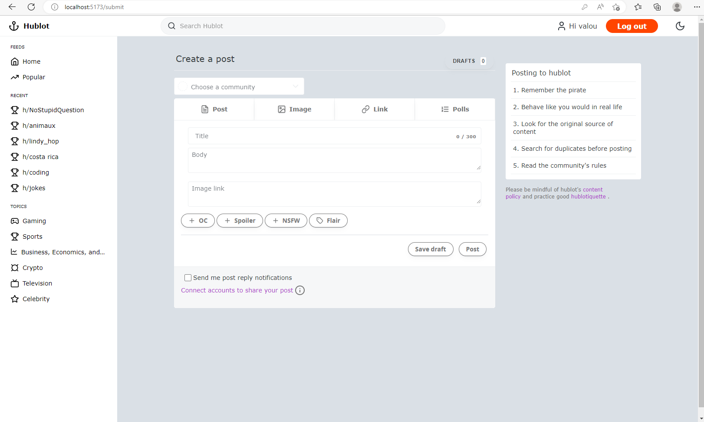

#### Création de communauté

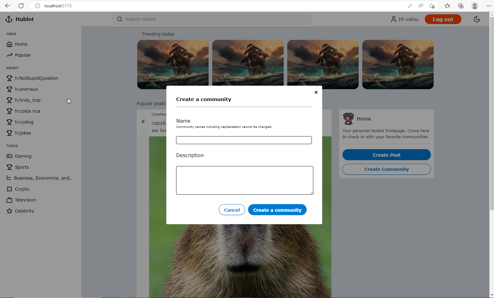

#### Page communauté

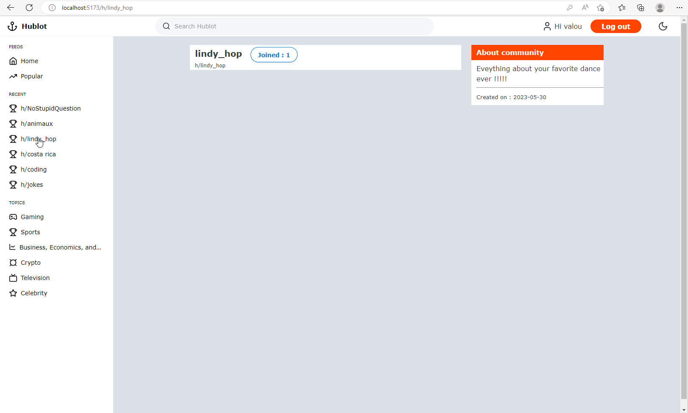

## Client Mobile

### Utilisation du client mobile

Pour l'application mobile, nous avons ajouté les pages suivantes: la page _Home_ et la page création de post. La page Home affiche tous les posts de la base de données. Tous les posts contiennent les éléments suivants: icon(account), nom de l'utilisateur ayant créé la publication, la date de création, un icon (3 points) permettant de supprimer un post, le titre, le contenu(s'il y a lieu), l'image(s'il y a lieu) ainsi que les boutons(icon) _upvote_ et _downvote_ tous les deux fonctionnels. Les autres boutons sont présents mais non fonctionnels: _comment_ et _share_.

Ensuite, la page _Create post_ est divisé en deux. Une première page contenant des champs _input_ permettant d'entrer le titre, le contenu et le lien de l'image désiré et une deuxième page pour choisir la communauté où publier.

Important: la création de publication peut se faire seulement si l'utilisateur est connecté! Une autre fonctionnalité que nous avons ajouté. Pour le moment, il faut se connecter à chaque création de publication, car l'application ne garde pas en mémoire l'utilisateur connecté après qu'une publication soit créée (problème à régler). Par contre, la publication se créée efficament selon l'utilisateur qui vient de se connecter.

Finalement, l'application contient une barre de navigation au bas de la page. Le premier icon renvoie à la page _Home_ (fonctionnelle), le deuxième à _Discovery_ (en construction), le troisième à la page _Create post_ (fonctionnelle), le quatrième à la page _Chat_ (en construction) et le dernier à la page _Inbox_ (en construction). Le haut de la page contient divers éléments aussi (afin d'imiter l'application Reddit): un icon menu(non fonctionnel), un _dropdown menu_ (non fonctionnel), un icon recherche (non fonctionnel) et un icon _account_ lui redirigeant vers la page de connexion. À noter que la page de connection permet d'accéder à la page de création de compte.

** Veuillez noter que les changements ont parfois de la difficulté à se faire en temps réel. Si un changement ne se fait pas dans la page Home (post supprimé, post ajouté), veuillez ouvrir une autre page (discovery par exemple), et revenir à Home.**

### Aide visuelle pour le mobile

En premier l'utilisateur se connecte.

#### Page Connexion

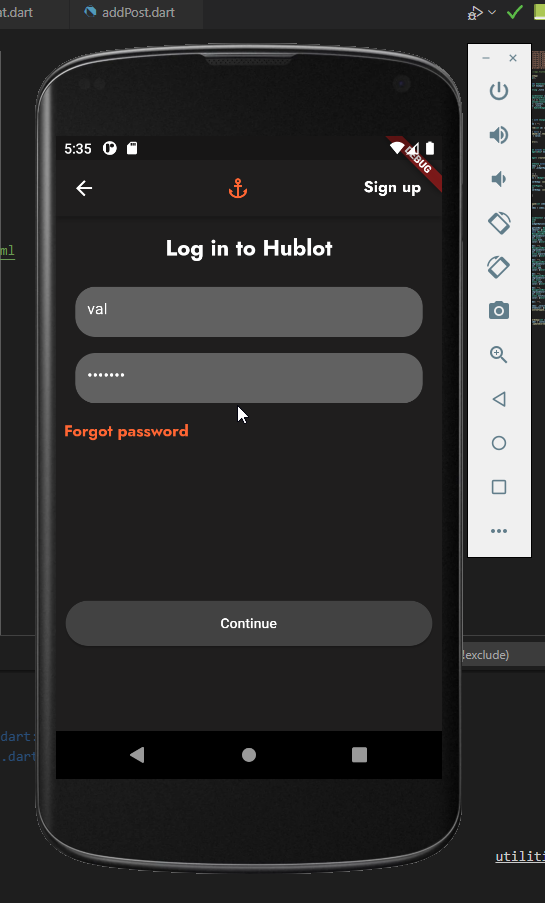

Après l'utilisateur insère le titre, le contenu et le lien de l'image du post à créer.

#### Page Create post

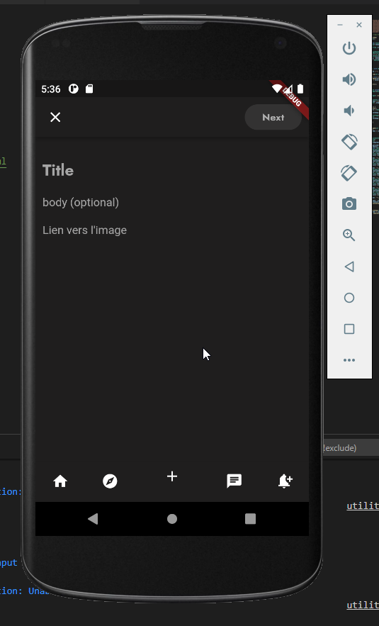

Il choisit la communauté désirée

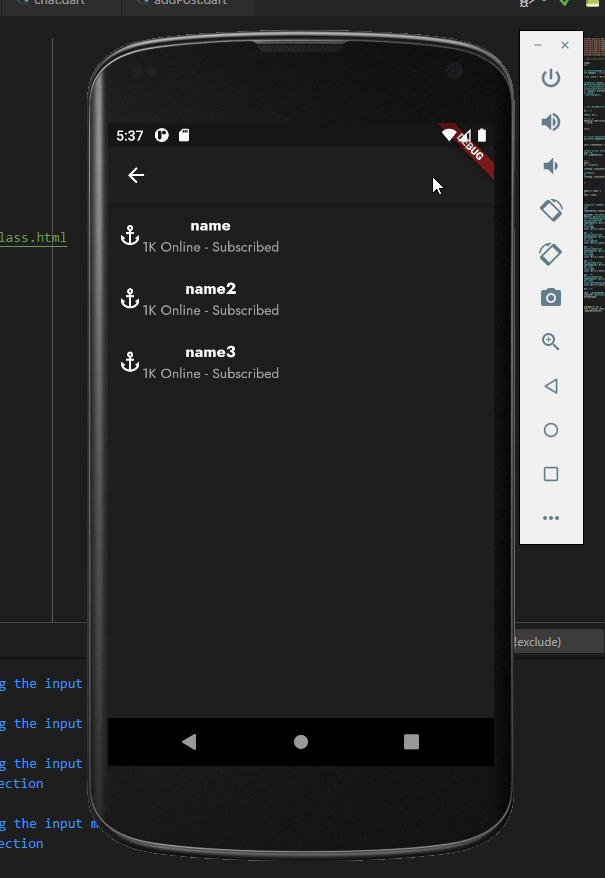

Il publie le tout!

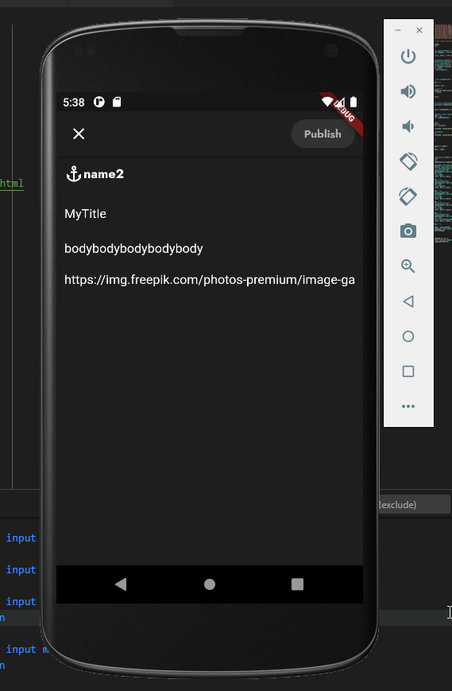

#### Page Home

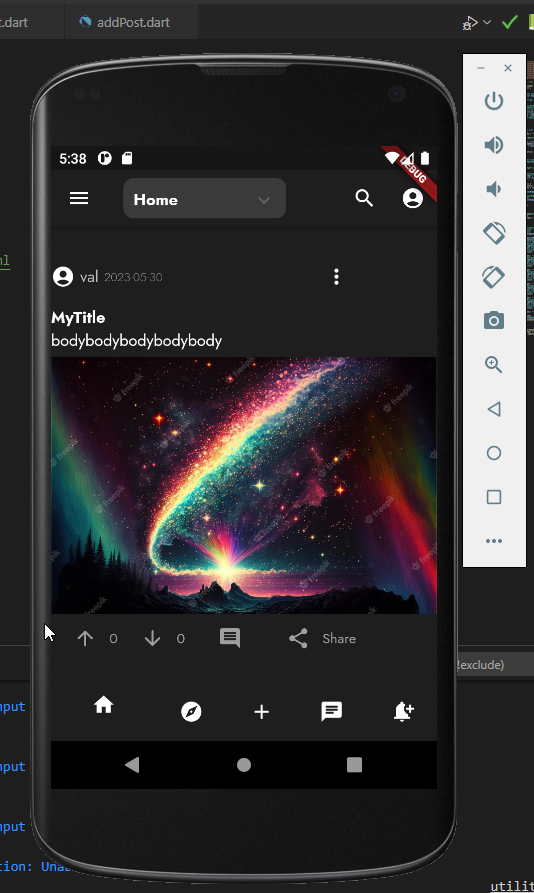

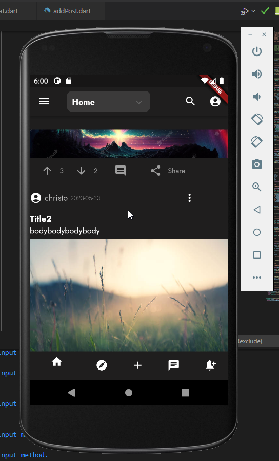

## Microservices

Nous avons développé les trois microservices: ms_community, ms_account, ms_post avec l'aide de java springboot et de maven. Nous avons pris avantage du pouvoirs des annotations Lombok et de plusieurs dépendences web et base de données qui s'intégraient dans un projet java backend comme le notre. Pour reproduire nos microservices il vous faudra lancer un projet avec springboot initializer <https://start.spring.io/> en sélectionnant les options suivantes : Maven, Java, Spring boot 3.1.0 Java 17 et Packaging .jar. Ensuite, pour éviter tout type d'erreur, je vous recommande de prendre ce document pom.xml et de remplacer le contenu généré par initializer par celui-ci:

```xml
<?xml version="1.0" encoding="UTF-8"?>
<project xmlns="http://maven.apache.org/POM/4.0.0"
	xmlns:xsi="http://www.w3.org/2001/XMLSchema-instance"
	xsi:schemaLocation="http://maven.apache.org/POM/4.0.0 https://maven.apache.org/xsd/maven-4.0.0.xsd">
	<modelVersion>4.0.0</modelVersion>
	<parent>
		<groupId>org.springframework.boot</groupId>
		<artifactId>spring-boot-starter-parent</artifactId>
		<version>3.0.6</version>
		<relativePath /> <!-- lookup parent from repository -->
	</parent>
	<groupId>com.example</groupId>
	<artifactId>ms_community</artifactId>
	<version>0.0.1-SNAPSHOT</version>
	<name>ms_community</name>
	<description>Demo project for Spring Boot</description>
	<properties>
		<java.version>17</java.version>
		<spring-cloud.version>2022.0.1</spring-cloud.version>
	</properties>
	<dependencies>
		<dependency>
			<groupId>org.springframework.boot</groupId>
			<artifactId>spring-boot-starter-data-jpa</artifactId>
		</dependency>
		<dependency>
			<groupId>org.springframework.boot</groupId>
			<artifactId>spring-boot-starter-web</artifactId>
		</dependency>
		<dependency>
			<groupId>org.hibernate.validator</groupId>
			<artifactId>hibernate-validator</artifactId>
		</dependency>

		<dependency>
			<groupId>org.postgresql</groupId>
			<artifactId>postgresql</artifactId>
			<scope>runtime</scope>
		</dependency>
		<dependency>
			<groupId>org.projectlombok</groupId>
			<artifactId>lombok</artifactId>
			<optional>true</optional>
		</dependency>
		<dependency>
			<groupId>org.springframework.boot</groupId>
			<artifactId>spring-boot-starter-test</artifactId>
			<scope>test</scope>
		</dependency>

		<dependency>
			<groupId>org.springdoc</groupId>
			<artifactId>springdoc-openapi-starter-webmvc-ui</artifactId>
			<version>2.1.0</version>
		</dependency>
		<dependency>
			<groupId>org.springframework.boot</groupId>
			<artifactId>spring-boot-starter-actuator</artifactId>
		</dependency>
		<dependency>
			<groupId>org.springframework.cloud</groupId>
			<artifactId>spring-cloud-starter-consul-discovery</artifactId>
		</dependency>
	</dependencies>
	<dependencyManagement>
		<dependencies>
			<dependency>
				<groupId>org.springframework.cloud</groupId>
				<artifactId>spring-cloud-dependencies</artifactId>
				<version>${spring-cloud.version}</version>
				<type>pom</type>
				<scope>import</scope>
			</dependency>
		</dependencies>
	</dependencyManagement>

	<build>
		<plugins>
			<plugin>
				<groupId>org.springframework.boot</groupId>
				<artifactId>spring-boot-maven-plugin</artifactId>
				<configuration>
					<excludes>
						<exclude>
							<groupId>org.projectlombok</groupId>
							<artifactId>lombok</artifactId>
						</exclude>
					</excludes>
				</configuration>
			</plugin>

			<plugin>
				<groupId>org.apache.maven.plugins</groupId>
				<artifactId>maven-surefire-plugin</artifactId>
				<version>2.19.1</version>
				<configuration>
					<testFailureIgnore>true</testFailureIgnore>
				</configuration>
			</plugin>
		</plugins>
	</build>

</project>
```

Assurez vous que le group id <groupId>com.example</groupId> représente les données que vous avez entrées lors de la création du projet.

Les prochaines étapes sont les mêmes pour chaque microservices, avec seul changement le contenu du modèle et du controlleur pour représenter les objets spécifiques à votre projet.

Dans le dossier contenant votre fichier application, créer un dossier controller, model, repository. Dans chacun, créer un fichier nommé XController, X, XRepository respectivement ou X est l'objet représenter par votre microservice, dans notre cas CommunityController par exemple. Votre arbre de projet devrait ressembler à ça pour le dossier src:

src  
--main  
----java  
------com  
--------exemple  
----------ms_community(nom de votre projet)  
------------controller  
--------------CommunityController.java  
------------model  
--------------Community.java  
------------repository  
--------------CommunityRepository.java  
------------MsCommunityApplication.java

Nous allons maintenant donner un exemple du code de chacun de ces 4 fichiers et expliquer les annotations et utilisations des technologies de développement java dans le cadre de notre projet pour faciliter votre compréhension et votre capacité à reproduire cette partie du projet. L'explication sera fait dans les commentaires du code et annoncée par une ligne comme celle-ci:
// **\*\***\*\***\*\***\*\*\***\*\***\*\***\*\***

### Code

#### Controller

```java
package com.example.ms_community.controller;

import java.util.ArrayList;
import java.util.List;
import java.util.Optional;

import io.swagger.v3.oas.annotations.Operation;
import io.swagger.v3.oas.annotations.media.Content;
import io.swagger.v3.oas.annotations.media.Schema;
import io.swagger.v3.oas.annotations.responses.ApiResponse;
import io.swagger.v3.oas.annotations.responses.ApiResponses;

import org.springframework.beans.factory.annotation.Autowired;
import org.springframework.http.HttpStatus;
import org.springframework.http.ResponseEntity;
import org.springframework.web.bind.annotation.CrossOrigin;
import org.springframework.web.bind.annotation.DeleteMapping;
import org.springframework.web.bind.annotation.GetMapping;
import org.springframework.web.bind.annotation.PathVariable;
import org.springframework.web.bind.annotation.PostMapping;
import org.springframework.web.bind.annotation.PutMapping;
import org.springframework.web.bind.annotation.RequestBody;
import org.springframework.web.bind.annotation.RequestMapping;
import org.springframework.web.bind.annotation.RestController;

import com.example.ms_community.repository.CommunityRepository;
import com.example.ms_community.model.Community;;
// *******************************
// Cross origin est une annotation fournie par la dépendance springframework web nous permettant de facilement gérer les demandes venant d'autres domaines vers notre microservice. Ici les paramètres sont ignorés pour prendre le comportement par défaut. RestController dit au projet et aux autres outils que cette class est un controlleur d'une api Rest. RequestMapping indique que la route de base pour ce api endpoint est /communities, les CRUD mapping qui suivent dans le code sont donc ajouté à ce chemin, par exemple le PostMapping plus bas sera accessible à /communities/add
@CrossOrigin
@RestController
@RequestMapping("/communities")
public class CommunityController {
    // *******************************
    // Autowired permet de trouver automatiquement le repository dans le projet
    @Autowired
    private CommunityRepository communityRepository;

    // *******************************
    // Les annotations Operation et ApiResponses viennent de la dépendance swagger ajoutée à notre projet dans le pom.xml mentionné plus haut. Ces annotations seront interprétées par swagger pour offrir de l'information sur l'api. Cette information peut être visualisé au localhost:(port défini dans application.properties pour votre projet java, ici 8081)/swagger-ui/index.html
    @Operation(summary = "Adds a community do the database")
    @ApiResponses(value = {
            @ApiResponse(responseCode = "201", description = "Community created", content = {
                    @Content(mediaType = "application/json", schema = @Schema(implementation = Community.class)) }),
            @ApiResponse(responseCode = "400", description = "Invalid data", content = @Content),
            @ApiResponse(responseCode = "500", description = "Internal server error", content = @Content)
    })
    @PostMapping("/add")
    public ResponseEntity<Community> addNewCommunity(@RequestBody Community newCommunity) {
        try {
            Community communityToAdd = communityRepository.save(new Community(newCommunity));
            return new ResponseEntity<>(communityToAdd, HttpStatus.CREATED);
        } catch (Exception e) {
            return new ResponseEntity<>(null, HttpStatus.INTERNAL_SERVER_ERROR);
        }
    }

    @Operation(summary = "Gets all communities")
    @ApiResponses(value = {
            @ApiResponse(responseCode = "200", description = "Found communities", content = {
                    @Content(mediaType = "application/json", schema = @Schema(implementation = Community.class)) }),
            @ApiResponse(responseCode = "404", description = "The communities were not found", content = @Content),
            @ApiResponse(responseCode = "500", description = "Internal server error", content = @Content)
    })
    @GetMapping("/view/all")
    public ResponseEntity<List<Community>> getAllCommunities() {
        try {
            List<Community> CommunityList = new ArrayList<Community>();

            communityRepository.findAll().forEach(CommunityList::add);

            if (CommunityList.isEmpty()) {
                return new ResponseEntity<>(HttpStatus.NO_CONTENT);
            }

            return new ResponseEntity<>(CommunityList, HttpStatus.OK);
        } catch (Exception e) {
            return new ResponseEntity<>(null, HttpStatus.INTERNAL_SERVER_ERROR);
        }
    }

    @Operation(summary = "Get a community by its id")
    @ApiResponses(value = {
            @ApiResponse(responseCode = "200", description = "Found the community", content = {
                    @Content(mediaType = "application/json", schema = @Schema(implementation = Community.class)) }),
            @ApiResponse(responseCode = "400", description = "Invalid id supplied", content = @Content),
            @ApiResponse(responseCode = "404", description = "The community was not found", content = @Content),
            @ApiResponse(responseCode = "500", description = "Internal server error", content = @Content)
    })
    @GetMapping("/view/{id}")
    public ResponseEntity<Community> getCommunityById(@PathVariable("id") long id) {
        Optional<Community> CommunityData = communityRepository.findById(id);

        if (CommunityData.isPresent()) {
            return new ResponseEntity<>(CommunityData.get(), HttpStatus.OK);
        } else {
            return new ResponseEntity<>(HttpStatus.NOT_FOUND);
        }
    }

    @Operation(summary = "Edits a community by its id")
    @ApiResponses(value = {
            @ApiResponse(responseCode = "200", description = "Community updated", content = {
                    @Content(mediaType = "application/json", schema = @Schema(implementation = Community.class)) }),
            @ApiResponse(responseCode = "400", description = "Invalid id supplied", content = @Content),
            @ApiResponse(responseCode = "404", description = "The community was not found", content = @Content),
            @ApiResponse(responseCode = "500", description = "Internal server error", content = @Content)
    })
    @PutMapping("/edit/{id}")
    public ResponseEntity<Community> updateCommunity(@PathVariable("id") long id,
            @RequestBody Community updateCommunity) {
        Optional<Community> communityData = communityRepository.findById(id);

        if (communityData.isPresent()) {
            Community modifiedCommunity = communityData.get();
            modifiedCommunity = new Community(updateCommunity);
            return new ResponseEntity<>(communityRepository.save(modifiedCommunity), HttpStatus.OK);
        } else {
            return new ResponseEntity<>(HttpStatus.NOT_FOUND);
        }
    }

    @Operation(summary = "Deletes a community by its id")
    @ApiResponses(value = {
            @ApiResponse(responseCode = "200", description = "Community deleted", content = {
                    @Content(mediaType = "application/json", schema = @Schema(implementation = Community.class)) }),
            @ApiResponse(responseCode = "400", description = "Invalid id supplied", content = @Content),
            @ApiResponse(responseCode = "404", description = "The community was not found", content = @Content),
            @ApiResponse(responseCode = "500", description = "Internal server error", content = @Content)
    })
    @DeleteMapping("/delete/{id}")
    public ResponseEntity<Community> deleteCommunity(@PathVariable("id") long id) {
        Optional<Community> communityData = communityRepository.findById(id);
        if (communityData.isPresent()) {
            try {
                Community deletedCommunity = communityData.get();
                communityRepository.deleteById(id);
                return new ResponseEntity<>(deletedCommunity, HttpStatus.OK);
            } catch (Exception e) {
                return new ResponseEntity<>(HttpStatus.INTERNAL_SERVER_ERROR);
            }
        } else {
            return new ResponseEntity<>(HttpStatus.NOT_FOUND);
        }
    }
}
```

#### Model

```java
package com.example.ms_community.model;

import java.sql.Date;

import jakarta.persistence.Column;
import jakarta.persistence.Entity;
import jakarta.persistence.GeneratedValue;
import jakarta.persistence.GenerationType;
import jakarta.persistence.Id;
import jakarta.persistence.Table;
import lombok.Getter;
import lombok.Setter;

// ******************************
// Les annotations Table et Entity font le travailler de communiquer l'information à la base de donnée sur le fait que cette classe doit être une entité pour java et une table pour postgres, permettant de manipuler les informations du côté code et du côté base de donnée avec une approche code first.
@Table(name = "community")
@Entity
// ******************************
// Les annotations Getter et Setter sont utilisées pour diminuer le code nécessaire pour intéragir avec les propriétés du model dans d'autres parties de votre application.
@Getter
@Setter
public class Community {
    // ******************************
    // Les annotations Id, GeneratedValue et Column permettent comme Table de communiqué des informations à la base de données sur le rôles des paramètres de cette classe et aussi de comprendre automatiquement leur types et leurs assignations.
    @Id
    @GeneratedValue(strategy = GenerationType.AUTO)
    private Integer id;

    @Column(name = "Community name")
    private String communityName;

    @Column(name = "Description")
    private String communityDescription;

    @Column(name = "Community logo")
    private String communityLogo;

    @Column(name = "Community header image")
    private String communityHeaderImage;

    @Column(name = "Created on")
    private Date communityCreatedOnDate;

    @Column(name = "Ammount of members")
    private Integer communityAmmountOfMembers;

    @Column(name = "Ammount of posts")
    private Integer communityAmmountOfPosts;

    @Column(name = "Community creator id")
    private Integer communityCreatorId;

    // ******************************
    // Les constructeurs permettent à notre controlleur de créer une instance du modèle à partir d'une entité au lieu de le faire a la main a chaque fois pour avoir les informations pour tous les champs.

    public Community() {

    }

    public Community(Community newCommunity) {
        this.communityName = newCommunity.getCommunityName();
        this.communityDescription = newCommunity.getCommunityDescription();
        this.communityCreatedOnDate = newCommunity.getCommunityCreatedOnDate();
        this.communityCreatorId = newCommunity.getCommunityCreatorId();
        this.communityLogo = newCommunity.getCommunityLogo();
        this.communityHeaderImage = newCommunity.getCommunityHeaderImage();
        this.communityAmmountOfMembers = newCommunity.getCommunityAmmountOfMembers();
        this.communityAmmountOfPosts = newCommunity.getCommunityAmmountOfPosts();
    }
}
```

#### Repository

Le repository est un outil qui permet à l'ORM offert par java de connecter nos entités à la base de donnée en utilisant une approche code first. En créant une interface qui extend CrudRepository nous permettons à notre application de faire les opérations crud sur nos entités et de voir les changements automatiquement représentés dans la base de données.

```java
package com.example.ms_community.repository;

import org.springframework.data.repository.CrudRepository;
import com.example.ms_community.model.Community;;

public interface CommunityRepository extends CrudRepository<Community, Long>{}
```

#### Application

Nous incluons le code du fichier d'application pour vous permettre de voir si le votre est semblable et aider dans le debuggage si jamais vous voyez des problèmes.

```java
package com.example.ms_community;

import org.springframework.boot.SpringApplication;
import org.springframework.boot.autoconfigure.SpringBootApplication;

@SpringBootApplication
public class MsCommunityApplication {

	public static void main(String[] args) {
		SpringApplication.run(MsCommunityApplication.class, args);
	}

}
```

#### application.properties

Dans ce fichier, il est important de comprendre plusieurs choses.

spring.application.name permet de reconnaitre l'application lors de l'exécution.

server.port peut être changer pour n'importe quel port qui n'est pas utilisé, mais il faudra faire attention de le changer plus loin dans la configuration du Dockerfile et de docker compose qui seront expliqués plus tard.

Les propriétés url, username et password sont les valeur de votre base de données.

Le bloc de propriétés jpa peut être copié, il permet à l'application de communiquer correctement avec la base de données.

Les propriétés de consul sont reliés à la configuration de consul dans le docker compose. Ici il faut mettre le nom du container donné à consul dans .host, le port dans .port et mettre true pour la dernière propriété pour permettre à ce micro-service d'être découvert par consul lors du déploiement sur docker.

```properties
spring.application.name=ms_community

server.port=8081

spring.datasource.url=jdbc:postgresql://localhost:5430/hublot.hull
spring.datasource.username=darksea
spring.datasource.password=root

spring.jpa.hibernate.ddl-auto=update
spring.jpa.properties.hibernate.dialect=org.hibernate.dialect.PostgreSQLDialect
spring.jpa.properties.hibernate.jdbc.lob.non_contextual_creation=true

spring.cloud.consul.host=consul-container
spring.cloud.consul.port=8500
spring.cloud.consul.discovery.prefer-ip-address=true
```

#### DockerFile

La dernière étape pour pouvoir exporter votre micro-service sous le format docker est de faire un dockerfile. Voici le code.

On construit l'image à partir (FROM) une image qui utilise déjà java 17 pour être compatible avec notre projet, on crée un volume tmp qui est nécessaire pour l'exécution de l'application jar et qui nous permettra de débugger lors de l'exécution du conteneur si besoin. On COPY le .jar de notre application à la racine de l'image et on spécifie que le point d'entrée lors de l'exécution de cette image est le .jar.

```docker
FROM eclipse-temurin:17-jdk-alpine
VOLUME /tmp
COPY target/*.jar app.jar
ENTRYPOINT ["java","-jar","/app.jar"]
```

### Exporter le tout vers votre repo dockerhub pour utilisation ultérieure

Placez vous à la racine de votre microservice et faites les commandes suivantes pour générer un nouveau .jar avec toutes vos modifications, construire l'image docker et la push vers votre registry en ligne.

```bash
mvn clean install

docker build -t registryname(ici darkseacollective)/app_imagenametage(ici ms_community:version1.1) .

docker push registryname(ici darkseacollective)/app_imagenametage(ici ms_community:version1.1)
```

### Docker compose

Pour compléter le backend, refaites les étapes de la dernière section pour chacun de vos microservices et revenez ici pour construire le fichier docker-compose.yaml qui vous permettra de lancer le backend en une commande. Nous allons encore utiliser les commentaires et la rangée d'étoile pour montrer ou sont les commentaires utiles à cette documentation.

```yaml
# Use postgres/example user/password credentials
version: "3.1"

# ***************************
# Les services dans un docker-compose sont toutes les images que vous voulez lancer dans le cadre du déploiement de votre conteneur. Ici le service db est la base de donnée postgres, adminer est un outil de gestion de bases de données qui permet de voir et de modifier graphiquement les informations de la base de données, consul-container sera l'image de consul qui servira de registre pour les micro-services et ensuite chaque ms_ service sera les microservices. Pour l'explication des paramètres, référez vous à la section docker du guide de développement vidéo.
services:
  db:
    image: postgres
    container_name: db
    restart: always
    environment:
      POSTGRES_USER: darksea
      POSTGRES_PASSWORD: root
      POSTGRES_DB: hublot.hull
    healthcheck:
      test: ["CMD-SHELL", "pg_isready -U $$POSTGRES_USER -d $$POSTGRES_DB"]
      interval: 1s
    expose:
      - "5432"
    ports:
      - "5432:5432"
    networks:
      - darksea
    volumes:
      - data:/var/lib/postgresql/data

  adminer:
    image: adminer:4.8.1
    container_name: adminer
    restart: always
    ports:
      - 8080:8080
    networks:
      - darksea

  consul-container:
    container_name: consul-container
    hostname: "consul-container"
    image: consul
    command: agent -server -ui -node=server1 -bootstrap-expect=1 -client=0.0.0.0
    environment:
      - CONSUL_BIND_INTERFACE=eth0
    ports:
      - "8500:8500"
      - "8600:8600/udp"
      - "8600:8600/tcp"
    networks:
      - darksea

  ms_community:
    image: darkseacollective/ms_community:version1.1
    container_name: ms_community
    ports:
      - "8081:8081"
    networks:
      - darksea
    environment:
      - SPRING_DATASOURCE_URL=jdbc:postgresql://db:5432/hublot.hull
      - SPRING_DATASOURCE_USERNAME=darksea
      - SPRING_DATASOURCE_PASSWORD=root
      - SPRING_JPA_HIBERNATE_DDL_AUTO=update
      - WAIT_FOR_HOSTS=consul-container:8500
    depends_on:
      db:
        condition: service_healthy
      consul-container:
        condition: service_started

  ms_account:
    image: darkseacollective/ms_account:version1.2
    container_name: ms_account
    ports:
      - "8082:8082"
    networks:
      - darksea
    environment:
      - SPRING_DATASOURCE_URL=jdbc:postgresql://db:5432/hublot.hull
      - SPRING_DATASOURCE_USERNAME=darksea
      - SPRING_DATASOURCE_PASSWORD=root
      - SPRING_JPA_HIBERNATE_DDL_AUTO=update
      - WAIT_FOR_HOSTS=consul-container:8500
    depends_on:
      db:
        condition: service_healthy
      consul-container:
        condition: service_started

  ms_post:
    image: darkseacollective/ms_post:version1.1
    container_name: ms_post
    ports:
      - "8083:8083"
    networks:
      - darksea
    environment:
      - SPRING_DATASOURCE_URL=jdbc:postgresql://db:5432/hublot.hull
      - SPRING_DATASOURCE_USERNAME=darksea
      - SPRING_DATASOURCE_PASSWORD=root
      - SPRING_JPA_HIBERNATE_DDL_AUTO=update
      - WAIT_FOR_HOSTS=consul-container:8500
    depends_on:
      db:
        condition: service_healthy
      consul-container:
        condition: service_started

networks:
  darksea:
    driver: bridge

volumes:
  data:
```

### Aide visuelle pour le backend

#### État de docker desktop après la commande docker compose up

Vous devriez retrouver l'état suivant dans votre docker desktop.

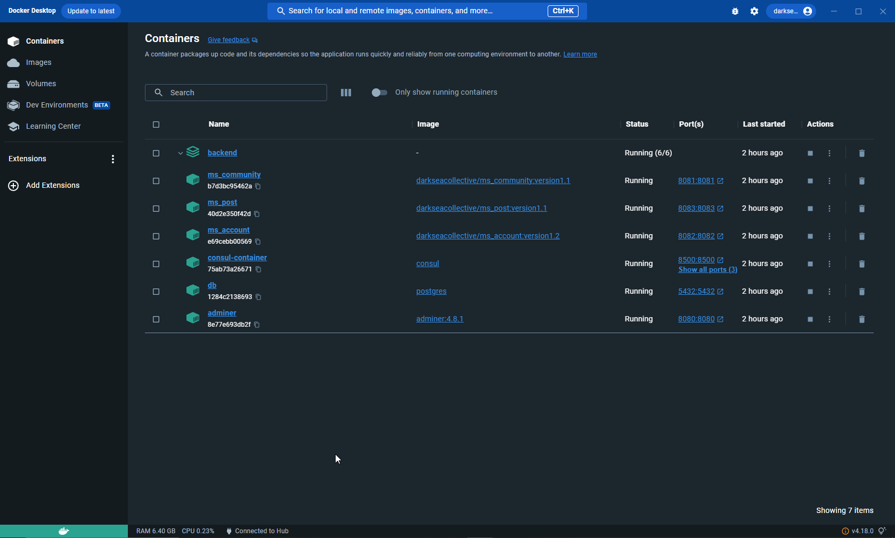

#### Consul après initialisation de tous les services

Vous devriez retrouver l'état suivant dans votre interface consul. Si les services n'affichent pas ou on un x rouge, laisser le temps à consul de finir la découverte.

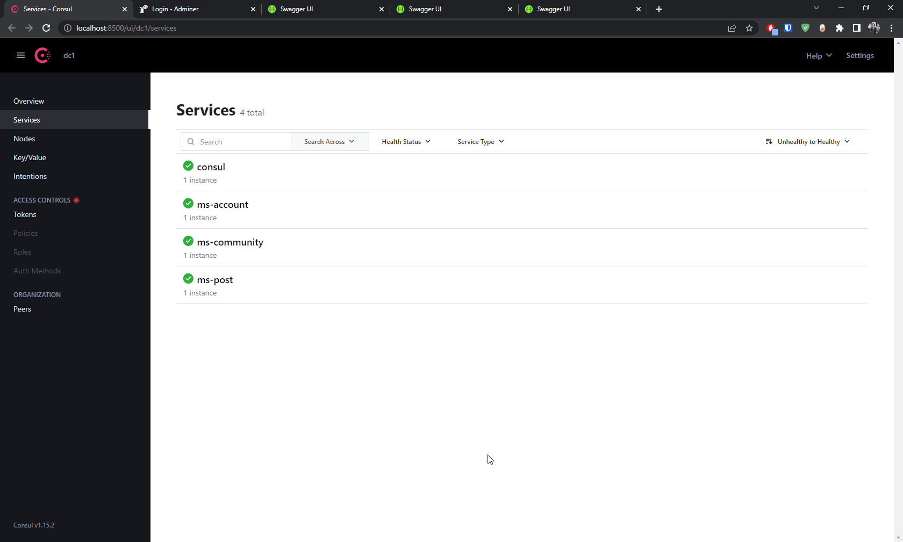

#### Adminer - votre page d'accueil pour l'utilisation de cet outil de gestion de base de donnée

Vous devriez retrouver l'état suivant dans votre interface adminer. Vous devez utiliser l'utilisateur darksea et le mot de passe root.

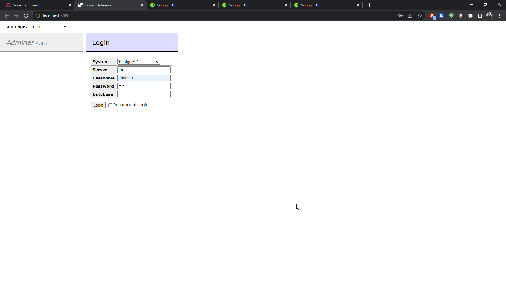

#### Adminer - votre page d'accueil pour l'utilisation de cet outil de gestion de base de donnée

Vous devriez retrouver l'état suivant dans votre interface adminer si vous naviguer vers la base donnée hublot.hull, sélectionnez une des table et ouvrez la section des données.

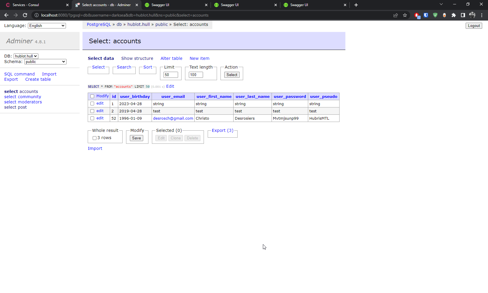

#### Microservice - community, swagger

Vous devriez retrouver l'état suivant dans votre interface swagger si vous suiver le lien offert dans docker desktop lorsque vos services roulent et que vous ajoutez /swagger-ui.html.

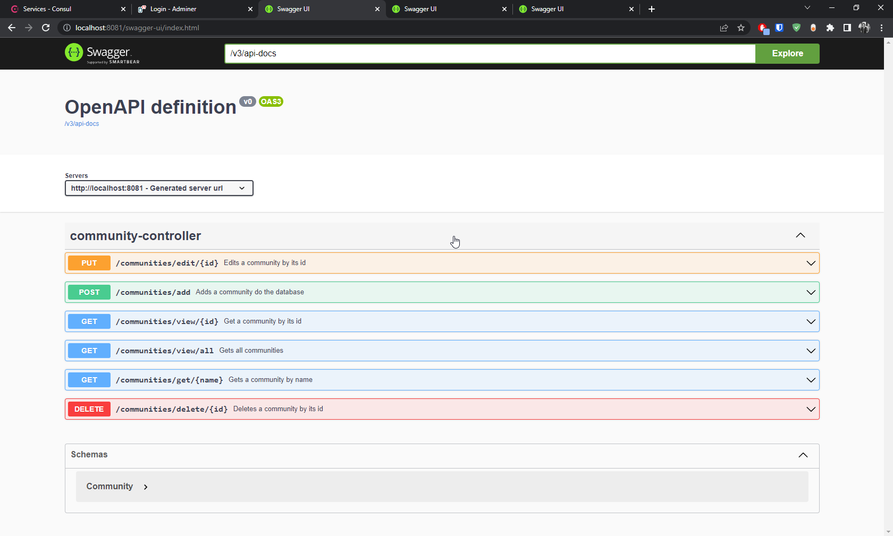

#### Microservice - post, swagger

Vous devriez retrouver l'état suivant dans votre interface swagger si vous suiver le lien offert dans docker desktop lorsque vos services roulent et que vous ajoutez /swagger-ui.html.

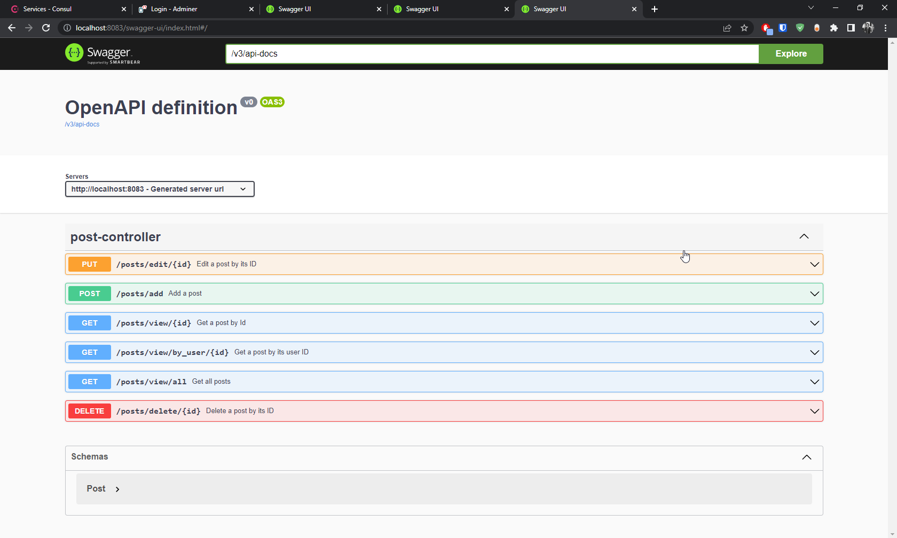

#### Microservice - account, swagger

Vous devriez retrouver l'état suivant dans votre interface swagger si vous suiver le lien offert dans docker desktop lorsque vos services roulent et que vous ajoutez /swagger-ui.html.

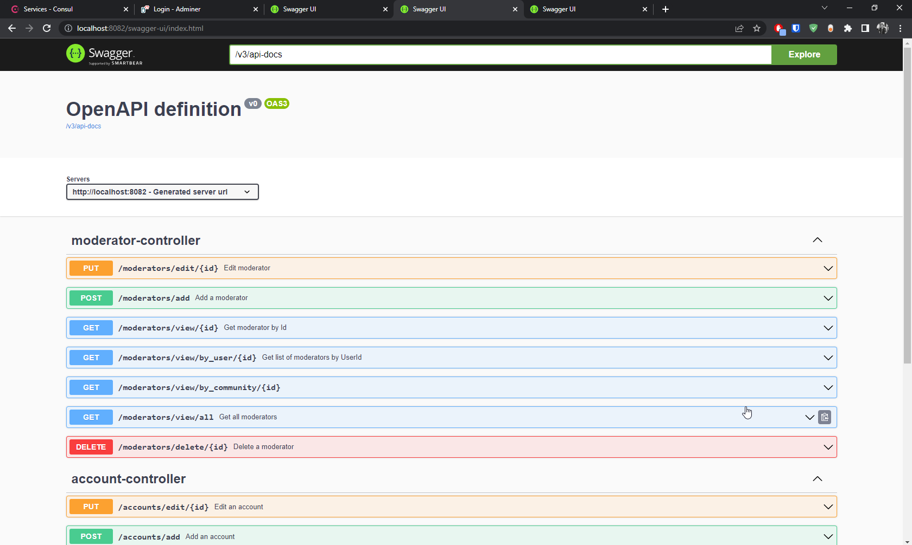

#### Notes sur les instructions

Toutes les étapes seront expliquées plus en profondeur dans les vidéos guide d'utilisateur.ice et fuide de développement. Voir la prochaine section.

# Guides
## Guide d'utilisateur.ice
### Mobile
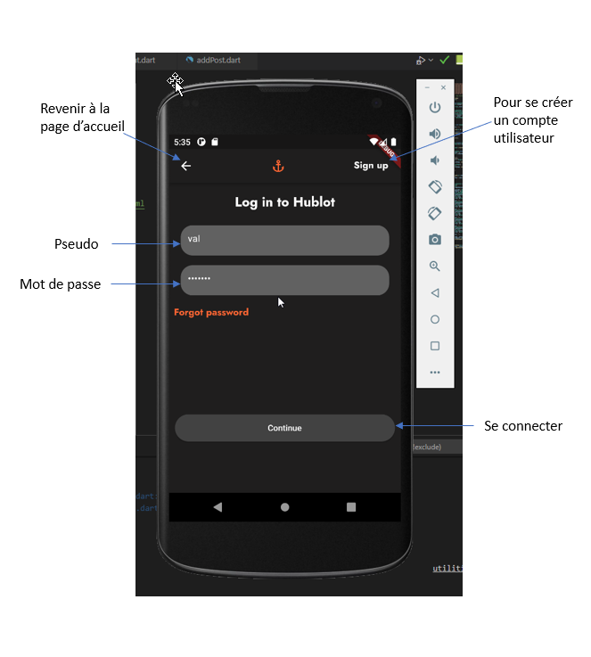
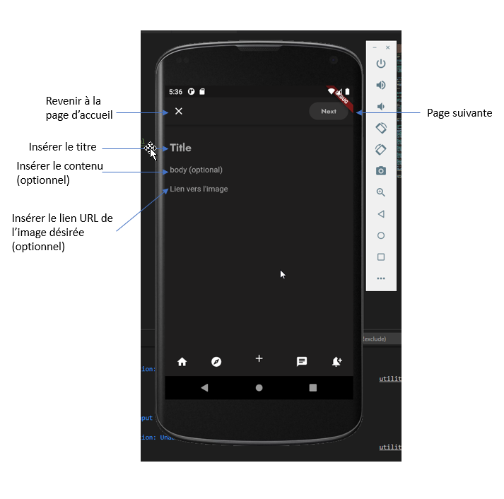
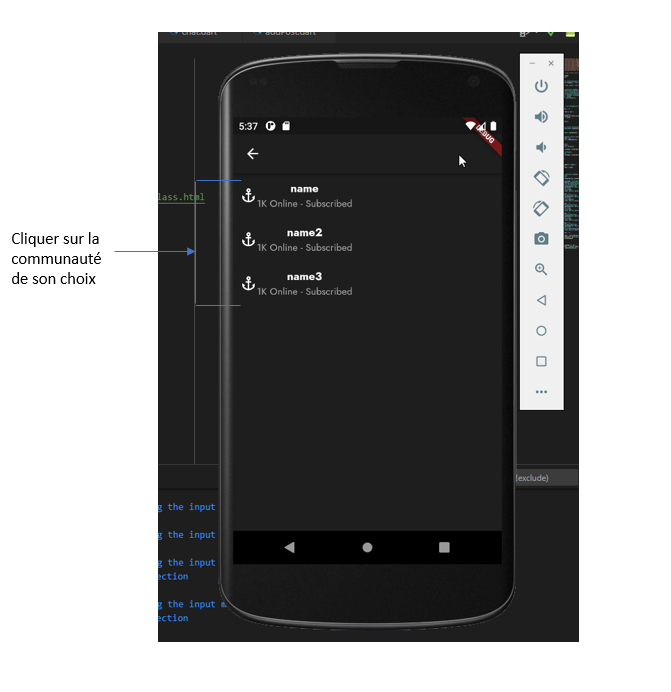
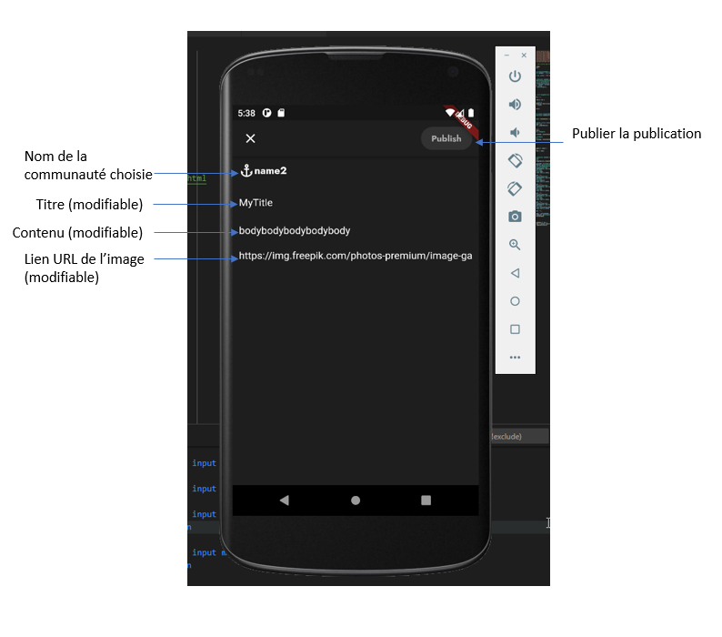
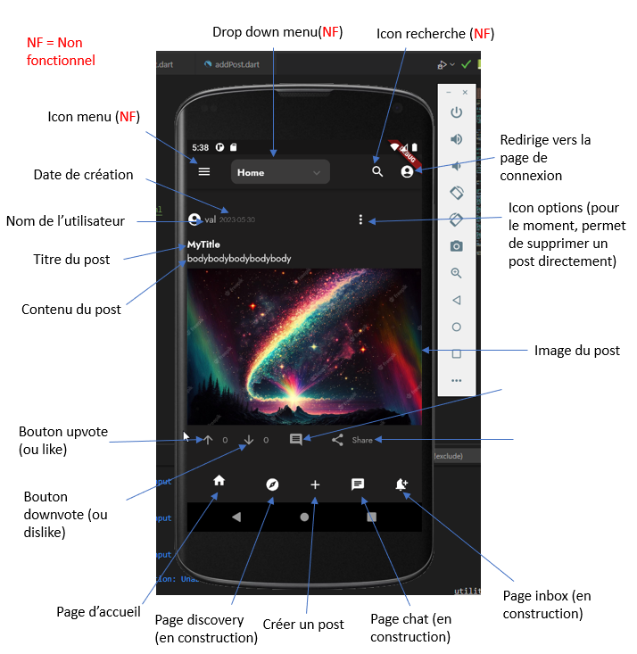

** Veuillez noter qu'il faut parfois changer de page et revenir à la page Home pour que le post apparaîsse. 
## Guide de développement
### Étapes d'installation

1. Installer Docker Desktop. Se référer aux étapes décrites dans le lien suivant: https://www.docker.com/products/docker-desktop/
2. Télécharger les deux dossiers zip: S4_FinalProject_Microservices et S4_FINALPROJECT.FRONTEND.
3. Ouvrir S4_FinalProject_Microservices dans VS Code.
4. Ouvrir le terminal dans VS Code et taper les commandes suivantes:
   ```shell
   cd ./backend
   docker compose up -d
   ```
   Les micro-services devraient maintenant rouler sur Docker Desktop.
5. Sur Docker Desktop: 
   - Il est possible d'accéder au registre *Consul* et à *Adminer* (système de gestion de la base de données) en cliquant sur le port correspondant.
   - Dans *Consul*, nous pouvon voir tous les micro-services et le nombre d'instance de chaque.
   - Dans *Adminer*, il faut s'enregistrer avec les paramètres suivants:
      ```
      système: postgresSQL   
      serveur: db   
      utilisateur: darksea  
      mot de passe: root  
      base de données: (laisser vide)
      ```
   - Cliquer sur Hublot.hull pour accéder aux tables et aux données.
6. Peupler la base de données avec Swagger. 
   - MS_community: http://localhost:8081/swagger-ui/index.html
   - MS_account: http://localhost:8082/swagger-ui/index.html
   - MS_post: http://localhost:8083/swagger-ui/index.html   
   Sélectionner la requête POST pour chaque micro-service et ajouter les fichiers json [data](seed_data.json) **un par un**. 

#### Partie Mobile
7. Installer Flutter en suivant les instructions du lien suivant: https://docs.flutter.dev/get-started/install
8. Ouvrir S4_FINALPROJECT_FRONTEND dans VS Code et installer les extensions Dart et Flutter. 
9. Si vous n'avez pas d'émulateur mobile, vous pouvez en créer un en installant Android Studio https://developer.android.com/studio?gclid=CjwKCAjwpuajBhBpEiwA_ZtfhXdJzQMO8SY7LjRs_Mo5nRh19Kz4uD2dRn7vFUNsVbG5fIhd8PL3uhoCBjsQAvD_BwE&gclsrc=aw.ds   
    Ensuite, aller dans Virtual Device Manager, choisir *Create Device*, choisir un téléphone dans la liste, puis télécharger le système d'exploitation au choix. Cliquer sur *Finish*.
    L'émulateur sera ajouté automatiquement sur VS Code.
    Cliquer sur *No device* ou *Windows* ou *Chrome* dans la barre du bas de la fenêtre de VS Code. Ensuite, sélectionner l'émulateur dans la barre du haut.
    Plus de détail dans le lien suivant: https://developer.android.com/studio/run/managing-avds
10. Rouler ensuite le projet en accédant à la page main dans ./interface_mobile/interface_mobile/lib  ou simplement en utilisant l'option Run dans la barre de haut de la fenêtre de VS Code. Le code écrit pour l'application se retrouve dans ./interface_mobile/interface_mobile/lib 

#### Partie Web
11. Dans VS Code, installer l'extension suivante: Svelte for VS Code.
12. Ouvrir le terminal, retourner à la base du projet et taper les commandes suivantes
   ```shell
   cd ./interface_web_svelte
   npm install
   npm run dev
   ```


# Améliorations futures et intropections sur le projet
