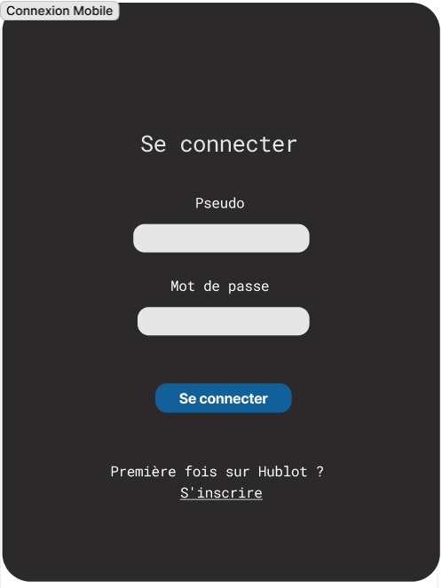

# Livrables

## Livrable 1
Pour le premier livrable, nous allons livrer les parties suivantes du développement du projet:

    1. Utilisation et configuration de Docker: postgres & micro-services
    2. Diagramme de classes
    3. Maquettes des différentes pages Web et mobiles
    4. API pour les micro-services suivants: compte utilisateur, publications et communautés

### Utilisation et configuration de Docker
Nous avons déployé postgres en container. Ainsi, la base de données peut facilement être utilisé sur une nouvelle machine. Cela permet aussi la conservation des données. Il suffit d'avoir Docker Desktop d'installer sur son poste de travail pour pouvoir utiliser la base de données. Responsable: Christopher

### Diagramme de classes
Le diagramme de classes décrit les relations entre les différentes entités du projet. Responsables: Christopher, Valérie et Lou

### Maquettes des pages Web et mobiles
Responsables: Valérie et Lou
#### Pages Web
##### Page Connexion

##### Page Inscription

##### Page Accueil

##### Page Création de publication

##### Page Création de communauté

#### Pages mobiles
##### Page Connexion

##### Page Inscription

##### Page Accueil

##### Page Création de publication

##### Page Création de communauté
